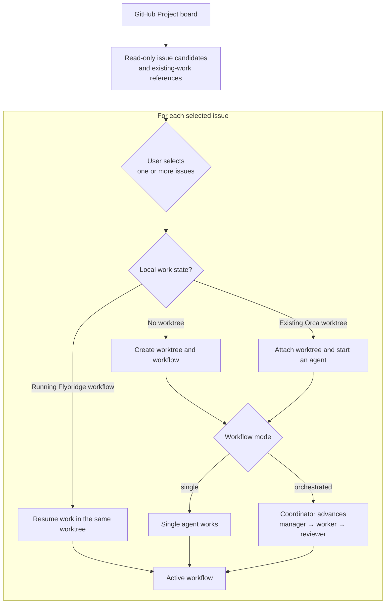
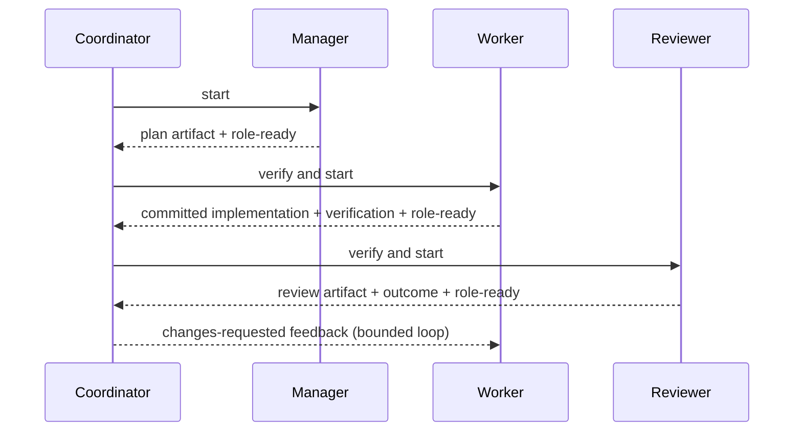

[English](README.md) | [日本語](docs/ja/README.md)


# Flybridge

Flybridge is a control plane for single-agent and orchestrated workflows on [Orca](https://www.onorca.dev/). It also integrates with GitHub Project boards to support issue-based development.

- [Specification](docs/en/specification.md)
- [Architecture](docs/en/architecture.md)
- [Architecture decision records](docs/en/decisions/)
- [Skill and command catalog](docs/en/skill-and-command-catalog.md)

## End-to-end workflow

Flybridge itself is designed to be operated through an LLM. Start an agent in the Flybridge repository root or a directory containing it, then work through tasks by interacting with the agent.

1. Retrieve issue information from a GitHub Project board.
2. Compare it with the local work state.
3. Have the user select one or more issues.
4. Work on each issue in its own worktree.



The flow is repeated for every selected issue, so several issues can be started or continued in separate worktrees. Candidate screening remains read-only and never selects or dispatches an issue automatically.

The screenshot below shows the Orca workspace after Flybridge starts an orchestrated workflow.


## Requirements and setup

- Linux or macOS.
- A running [Orca](https://www.onorca.dev/) installation with its version-matched CLI. `doctor` verifies that the runtime is reachable before a workflow can be started.
- Python 3.11 or newer and [uv](https://docs.astral.sh/uv/). CI tests Python 3.11, 3.12, and 3.13; the `requires-python` metadata is the authoritative minimum.
- Git is required for workflow repositories. `gh` is required only when the optional GitHub Project screening integration is enabled.

Flybridge is supported as a source checkout. It does not publish a single installable distribution or support `pip install flybridge`.

```bash
uv sync --all-packages
cp config/flybridge.jsonc.example config/flybridge.jsonc
uv run --package flybridge-cli flybridge doctor
```

## Configuration

The default user configuration is `config/flybridge.jsonc`. Copy an example from the same directory before customizing it. You can also ask an LLM to customize it for you. Use `--config` to select another configuration file.

| Key                               | Description                                                                                                                                             | Value                                                   |
| :-------------------------------- | :------------------------------------------------------------------------------------------------------------------------------------------------------ | :------------------------------------------------------ |
| `default_mode`                    | Start one agent role or Flybridge's fixed orchestrator.                                                                                                 | `single`, `orchestrated`                                |
| `state_dir`                       | Private directory for SQLite state and content-addressed plan, verification, and review artifacts.                                                      | Any path                                                |
| `orca.executable`                 | Orca CLI command to invoke.                                                                                                                             | `orca-ide` or an executable path                        |
| `orca.agents`                     | Agent and optional model for each role. `reviewer` may be a list; the coordinator waits for every report.                                               | TUI id, `{agent, model}`, or a reviewer list            |
| `orca.launch_presets`             | Optional tracked JSON file replacing the packaged agent launch presets.                                                                                 | Absolute or config-relative path                        |
| `orca.launch_overrides`           | Optional untracked JSON file replacing selected local presets. Missing override files are ignored.                                                      | Absolute or config-relative path                        |
| `reconcile`                       | Automatic workflow-command sync, missing-worktree threshold/grace, event retention, and optional excluded worktree names/globs.                         | Optional; defaults to `true`, `2`, `300`, `10000`, `[]` |
| `skills.sources`                  | Skill paths shared by every role.                                                                                                                       | Array of document, catalog-directory, or glob paths     |
| `skills.roles`                    | Additional skill paths by role.                                                                                                                         | Object containing a path array for each role            |
| `skills.operator`                 | Private guidance read by the parent operator; it does not create a workflow role.                                                                       | Array of document, catalog-directory, or glob paths     |
| `skills.response_language`        | Language used by the agent's responses.                                                                                                                 | A language name, such as `Japanese`                     |
| `queue.observer`                  | Whether to open a queue observer terminal for root workflows. An enabled observer is restored after its agent terminal is replaced.                     | `true`, `false`                                         |
| `queue.resources`                 | Names of mutually exclusive resources injected into role prompts.                                                                                       | Array of strings                                        |
| `orchestration.max_review_cycles` | Maximum autonomous worker/reviewer cycles before the run becomes blocked.                                                                               | Positive integer                                        |
| `github.enabled`                  | Whether to use GitHub Project integration.                                                                                                              | `true`, `false`                                         |
| `github.login`                    | Your GitHub username. Default `gh` account for Flybridge GitHub commands, default assignee for `board screen`, and default `--author` for `prs screen`. | A login                                                 |
| `github.boards`                   | Projects to read (owner, number, Status/Priority field names).                                                                                          | Array of objects                                        |

Skill paths accept documents, catalog directories, and glob patterns. Directories expand to their `SKILL.md` files in sorted order, and `~` and directory symbolic links are resolved, so a shared `~/projects/...` prefix can point at different physical locations per machine. Documents are never copied into a target repository.

Run `flybridge operator guide` before cross-worktree operational work to obtain the configured Operator document index. The command prints paths and response language, never private document content. The Operator is the caller that starts and progresses workflows, not a fifth Flybridge workflow role.

## Ask your LLM

Run an LLM in the Flybridge repository or one of its parent directories, then state your objective in natural language. [AGENTS.md](AGENTS.md) is the concise agent entrypoint for Codex, Claude, and Cursor; it links to detailed user and technical documentation without duplicating it. The LLM can run `doctor` first when needed to check the configuration and [Orca](https://www.onorca.dev/) runtime, then select the appropriate Flybridge or project command. For implementation work, name the target repository and workflow mode.

Choose `single` for a small, independent change. Choose `orchestrated` when planning, implementation, and review add value. The manager does not commit a plan; the worker commits implementation before review.

Copy this template and fill in `<...>` for a consistent implementation request:

```text
Use `<single or orchestrated>` mode in `<target repository>` to implement `<issue or task>`.
Done when: `<expected behavior or change>`
Verify with: `<tests, lint, headed run, etc.>`
```

| Request                                                                   | Result                                                                                                                                                                                                                                                        |
| ------------------------------------------------------------------------- | ------------------------------------------------------------------------------------------------------------------------------------------------------------------------------------------------------------------------------------------------------------- |
| “List the issues assigned to me.”                                         | Runs `flybridge board screen` (assignee defaults to `github.login`). Read-only. If the list is long, ask which `--status`, `--priority`, or `--board` filter to add; do not truncate.                                                                         |
| “List the pull requests I opened.”                                        | Runs `flybridge prs screen` (`--author` defaults to `github.login`). Read-only. Pass `--with-review-facts` for review bodies. Does not filter by local worktrees.                                                                                             |
| “List every High-priority Todo, regardless of assignee.”                  | Runs `flybridge board screen --all-assignees --status Todo --priority High`.                                                                                                                                                                                  |
| “List issues assigned to me that still have no local worktree or branch.” | Runs `flybridge board screen --with-refs`, then the caller decides from empty `worktrees` and `development`. Join key is the GitHub issue URL in the Orca comment (or a same-repo linked issue), not the directory name.                                      |
| “Implement `<issue or task>` in single mode.”                             | Runs `doctor --mode single`, then `workflow start --mode single --issue <canonical GitHub issue URL>`.                                                                                                                                                        |
| “Implement `<issue or task>` in orchestrated mode.”                       | Runs `doctor --mode orchestrated`, then `workflow start --mode orchestrated --issue <canonical GitHub issue URL>`. The durable coordinator advances roles without operator proceed.                                                                           |
| “Check the progress.”                                                     | Uses `workflow status <workflow-id>` to inspect `progress`, the run, review cycle, role state, repository identities, artifacts, and coordinator outcome; uses `queue status` when relevant. A parked manager answers the same question by reading that JSON. |
| “Resume the interrupted work.”                                            | Uses `workflow resume <workflow-id>` with its persisted worktree. For a failed workflow, it inspects state and uses `workflow cleanup` and `workflow retry` as appropriate.                                                                                   |
| “Resume work in this existing worktree.”                                  | Uses `workflow start <worktree-path> --attach-existing`. It starts a new agent in the same checkout. A Flybridge-managed workflow keeps its ID; an unmanaged checkout is attached as a new root workflow.                                                     |
| “I want to inspect the result visually; run it headed.”                   | Inspects the target project's test/browser options and selects an available headed run. Flybridge itself has no `headed` subcommand.                                                                                                                          |
| “Show me the queue wait state.”                                           | Uses `queue status`; use `queue watch` for a live display. A worktree observer also delivers a lease-id prompt after FIFO promotion.                                                                                                                          |

## About orchestrated mode

When you start orchestrated mode, a `Manager → Worker → Reviewer` team works in the worktree under the direction of the Coordinator that operates Flybridge. Once the request has been handed to the Manager, the Coordinator is freed up and can receive instructions for other worktrees.

The Manager focuses on decisions and planning, delegates implementation to the Worker, and leaves code review and comparison with the issue scope to the Reviewer. This keeps threads short and limits context pollution.

Because the Manager, Worker, and Reviewer have distinct responsibilities, the best agent for each role may differ. Flybridge therefore lets you configure the model and skills for each role separately.



## Development

```bash
uv sync --all-packages
uv run pre-commit install
uv run pre-commit run --all-files
uv run python scripts/test.py -q
```

Brand PNGs require ImageMagick. Regenerate the square logo and README header from the canonical SVG with `uv run python scripts/generate_brand_images.py`. Pass `--output`, `--width`, and `--height` together to render another size.

The MIT license is the root `LICENSE` file. Package metadata repeats the SPDX identifier only; this source checkout is not published as independent wheels.

CI runs secret scanning, the same pre-commit hooks and tests, and all package builds. The hooks remove metadata from PNG, GIF, JPEG, and WebP images; they also cover the public source privacy audit, display-width-aware Markdown table formatting, markdownlint (without a line-length wrap), Ruff, and file hygiene. When image metadata is removed, stage the changed image and rerun pre-commit. Copy `.private-audit.yaml.example` to the gitignored `.private-audit.yaml` before local hook runs. Pull requests skip the privacy audit because they do not receive the private deny list.

## Security

Please do not report vulnerabilities in a public issue. See [`SECURITY.md`](SECURITY.md) for the supported versions and a private reporting path.
