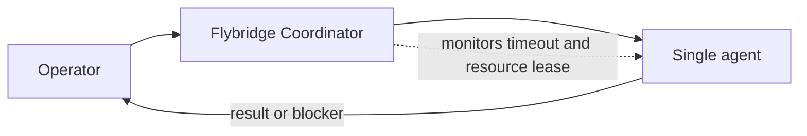
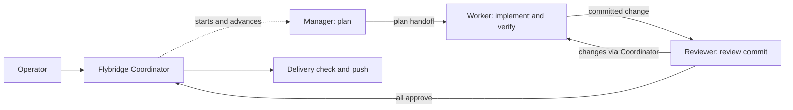
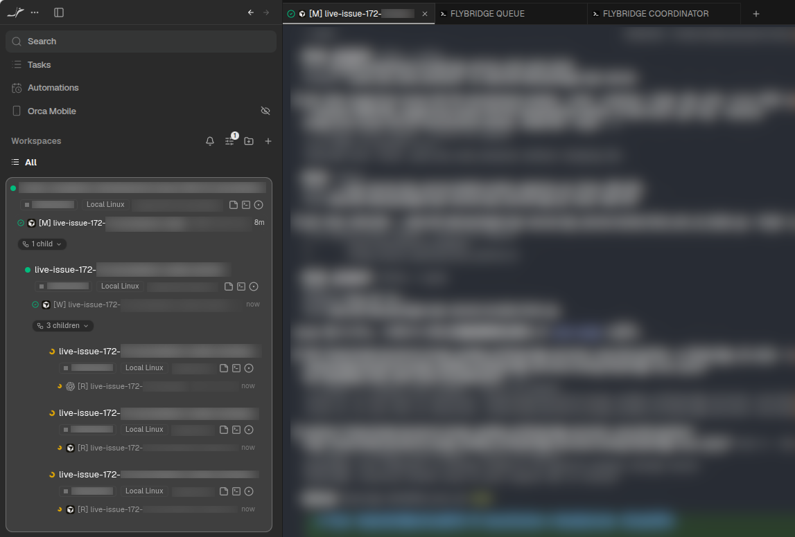
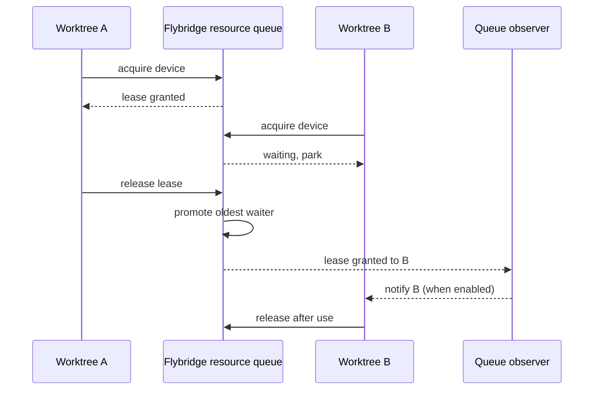

[English](README.md) | [日本語](docs/ja/README.md)


# Flybridge

Flybridge starts and tracks software development workflows in [Orca](https://www.onorca.dev/). Orca provides worktrees, agent terminals, and a workspace view. Flybridge provides workflow state, a choice of one agent or a coordinated team, and a queue for operations that cannot run at the same time. Optional GitHub Project integration helps you find work; it does not choose issues or start workflows on its own.

Use Flybridge from a source checkout through its CLI, or ask an LLM working in this repository to run the commands for you.

## Requirements and setup

- Linux or macOS.
- A running [Orca](https://www.onorca.dev/) installation with its version-matched CLI. `doctor` checks that the runtime is reachable.
- Python 3.11 or newer, [uv](https://docs.astral.sh/uv/), and Git.
- The `gh` CLI only when optional GitHub integration is enabled.

You can ask an LLM running in this repository or a parent directory to perform the setup and customize the configuration. After setup, tell the agent the target repository or existing worktree, objective, mode, completion criteria, and checks to run.

Flybridge is supported as a source checkout. It does not publish an installable `pip install flybridge` distribution.

```bash
uv sync --all-packages
cp config/flybridge.jsonc.example config/flybridge.jsonc
uv run --package flybridge-cli flybridge doctor
```

## How the work is organized

Flybridge manages work through its workflow records and Orca worktrees. You can start or resume multiple tasks independently and inspect their status in Orca. Flybridge records exact worktree IDs so a resume returns to the existing checkout.

There are two workflow modes:

| Mode           | What happens                                                                                                                                                                                                             | Good fit                                              |
| :------------- | :----------------------------------------------------------------------------------------------------------------------------------------------------------------------------------------------------------------------- | :---------------------------------------------------- |
| `single`       | One agent implements and checks the change. The operator verifies its report and finishes the workflow.                                                                                                                  | Small, independent changes.                           |
| `orchestrated` | A Manager plans, a Worker implements and verifies, and one or more Reviewers assess the committed result. A durable Coordinator advances the roles and handles requested changes within a configured review-cycle limit. | Work that benefits from separate planning and review. |

In single mode, the Flybridge Coordinator starts one agent in an Orca worktree and monitors its timeout and resource lease. The agent implements and verifies the change, reviews its own work, commits and pushes after local checks pass, then reports the result or a blocker. The Operator checks the report and finishes the workflow.



In orchestrated mode, the same Flybridge Coordinator advances three AI roles. The Manager records a plan without changing the repository. The Worker implements the change, runs required checks, commits, and records verification. The Reviewer checks that commit. A changes-requested review returns the work to the Worker within the configured cycle limit; when all Reviewers approve the same commit, the Coordinator harvests it, runs the delivery check, and pushes it. Agent, model, and external skills can be configured for each role.



In orchestrated mode, multiple agents start in a hierarchy and divide the work as shown below. This example uses three Reviewers with different LLM models to improve robustness. Title prefixes identify the AI roles: `[M]` = Manager, `[W]` = Worker, and `[R]` = Reviewer. Single mode uses `[S]`. If an LLM updates its own title, that title takes precedence.



## Sharing exclusive resources

Parallel worktrees can still contend for a device, test rig, large build, or another operation that must run alone. Configure resource names in `queue.resources`; agents then acquire a lease before a conflicting operation and release it afterward. Flybridge grants leases in first-in, first-out order per resource. A waiting agent parks; when the queue observer is enabled, it delivers the granted lease so the agent can continue. Other worktrees remain free to run. A heavy verification run is one use case, not a special queue type.



Use `queue status` for counts, `queue status --details` to identify active request IDs and owners, and `queue watch` for live events. Old leases are flagged for attention without being released; verify external cleanup before explicitly releasing or cancelling one. The queue tracks workflow ownership and survives CLI process exits. See the [resource queue contract](docs/en/specification.md#resource-queue-contract) for the lifecycle and recovery rules.

## Optional GitHub Project workflow

With `github.enabled` and boards configured, `board screen` lists candidate issues. Add `--with-refs` to see related local worktrees and development references; `prs screen` lists authored pull requests. These commands are read-only. You select the issue and then start or resume its workflow. Directory names are not used as issue identifiers.

```bash
uv run --package flybridge-cli flybridge board screen --with-refs
uv run --package flybridge-cli flybridge prs screen
```

For an existing checkout, `workflow start --attach-existing` keeps that worktree. For several existing worktrees, `workflow start --batch <file.json>` starts their workflows sequentially and reports each result. See the [specification](docs/en/specification.md) for batch input and recovery commands.

## Configuration and reference

The default user configuration is `config/flybridge.jsonc`; `--config` selects another JSONC file. Copy the example before editing it. The main settings are:

| Key                                               | Purpose                                                               |
| :------------------------------------------------ | :-------------------------------------------------------------------- |
| `default_mode`                                    | Default to `single` or `orchestrated`.                                |
| `orca.agents`                                     | Agent and optional model for each role; `reviewer` may be a list.     |
| `skills.sources`, `skills.roles`                  | Shared and role-specific external skill paths.                        |
| `skills.operator`                                 | Guidance index for the parent operator, separate from workflow roles. |
| `skills.response_language`                        | Language of agent responses.                                          |
| `queue.resources`, `queue.observer`               | Resource names and the visible queue observer policy.                 |
| `orchestration.max_review_cycles`                 | Maximum autonomous worker/reviewer cycles.                            |
| `github.enabled`, `github.login`, `github.boards` | Optional GitHub integration.                                          |
| `state_dir`, `reconcile`                          | Durable state location and Orca reconciliation policy.                |

Skill paths may point to documents, catalog directories, or globs. Flybridge resolves them at workflow start and passes an index to the appropriate roles; it does not copy their contents into the target repository. Run `flybridge operator guide` before cross-worktree operational work to see the configured Operator document index.

- [Specification](docs/en/specification.md): commands, state, and operational rules.
- [Architecture](docs/en/architecture.md) and [decisions](docs/en/decisions/): implementation boundaries and rationale.
- [Skill and command catalog](docs/en/skill-and-command-catalog.md): bundled commands and skills.

## Development

```bash
uv sync --all-packages
uv run pre-commit install
uv run pre-commit run --all-files
uv run python scripts/test.py -q
```

CI runs secret scanning, pre-commit, tests, and package builds. Install Node.js 22.13 or newer to run the Mermaid rendering check in pre-commit. Copy `.private-audit.yaml.example` to the ignored `.private-audit.yaml` before local pre-commit runs. Brand images are generated from the canonical SVG with `uv run python scripts/generate_brand_images.py` and ImageMagick. The root [LICENSE](LICENSE) is MIT.
