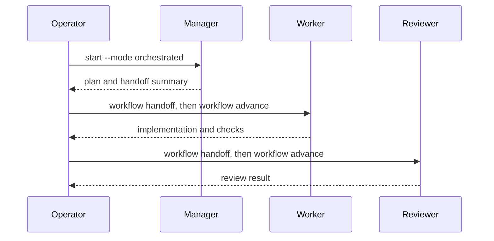

[English](README.md) | [日本語](README_ja.md)

# Flybridge

Flybridge is an Orca-native control plane for single-agent and role-separated
agent workflows. It keeps workflow state deterministic and injects external
skills by path. GitHub Project support is optional, read-only candidate screening.

- [Specification](docs/specification.md)
- [Architecture](docs/architecture.md)
- [Architecture decision records](docs/decisions/)
- [Skill and command catalog](docs/skill-and-command-catalog.md)


## Requirements and setup

- Python 3.11 or newer and [uv](https://docs.astral.sh/uv/). CI tests Python
  3.11, 3.12, and 3.13; the `requires-python` metadata is the authoritative minimum.
- A running Orca installation with its version-matched CLI. `doctor` verifies
  that the runtime is reachable before a workflow can be started.
- Git is required for workflow repositories. `gh` is required only when the
  optional GitHub Project screening integration is enabled.

Flybridge is supported as a source checkout. It does not publish a single
installable distribution or support `pip install flybridge`.

```bash
uv sync --all-packages
cp config/flybridge.jsonc.example config/flybridge.jsonc
uv run --package flybridge-cli flybridge doctor
```

## Configuration

`config/flybridge.jsonc` is the only user-configuration source, and `--config`
selects a different file. Git ignores it, so it can hold the absolute paths of
one machine.

- `default_mode`: `single` or `orchestrated`. Only `start --mode` and
  `doctor --mode` override it.
- `state_dir`: directory that holds the SQLite workflow and queue state.
- `orca.executable`: the Orca CLI command to call.
- `orca.agents`: the agent launched for each role (`single`, `manager`,
  `worker`, `reviewer`).
- `skills.sources`: absolute skill paths shared by every role.
- `skills.roles`: additional absolute skill paths per role.
- `skills.response_language`: the language the agent answers in.
- `skills.language_specific`: overlay documents injected for that language.
- `queue.observer`: open a visible queue terminal for root workflows.
  `start --queue-observer` and `start --no-queue-observer` override it.
- `queue.resources`: mutually exclusive resource names injected into role
  prompts.
- `github`: optional read-only Project screening. Keep `enabled` false when it
  is unused.

Skill paths accept documents, catalog directories, and glob patterns.
Directories expand to their `SKILL.md` files in sorted order, and `~` and
directory symbolic links are resolved, so a shared `~/projects/...` prefix can
point at different physical locations per machine. Documents are never copied
into a target repository.

## Commands and roles

Start a workflow after `doctor` reports a reachable Orca runtime. `doctor --mode`
validates a specific mode; without it, `doctor` validates `default_mode`.
`start`, `workflow launch`, `workflow advance`, and `workflow resume` also
verify that the runtime is reachable.

```bash
uv run --package flybridge-cli flybridge doctor
uv run --package flybridge-cli flybridge start /path/to/repository --mode single --objective "Inspect and implement the task."
uv run --package flybridge-cli flybridge start /path/to/repository --mode orchestrated --objective "Inspect and implement the task."
```

Starting the same root objective again in the same repository is rejected while
the first root is requested, starting, or running. Use `--allow-duplicate` only when the
duplicate is intentional; different objectives are not blocked.

In orchestrated mode, Flybridge uses the fixed `manager → worker → reviewer`
plan. The manager plans and writes a handoff; it must not implement, delegate,
create agents, or start nested orchestration. Starting launches the manager and
records child roles. After each completed role, record its single-line handoff
and then run `workflow advance` with the manager workflow ID:



```bash
uv run --package flybridge-cli flybridge workflow complete <manager-id>
uv run --package flybridge-cli flybridge workflow handoff <manager-id> <worker-id> --summary "Plan and scope are ready."
uv run --package flybridge-cli flybridge workflow advance <manager-id>
uv run --package flybridge-cli flybridge workflow complete <worker-id>
uv run --package flybridge-cli flybridge workflow handoff <worker-id> <reviewer-id> --summary "Implementation and checks are ready."
uv run --package flybridge-cli flybridge workflow advance <manager-id>
uv run --package flybridge-cli flybridge workflow complete <reviewer-id>
```

Each child role runs in a new worktree created from the previous role's branch,
so only committed work reaches the next role. Every orchestrated role prompt
states this, and `workflow advance` fails when the source worktree still has
uncommitted changes, so an implementation is never dropped before review.

Use `workflow fail <workflow-id> --error "..."` when a role cannot complete.
Reconcile its external worktree with `cleanup`, then use `workflow retry` when
the same role should be started again. Retry cancels queue requests left by the
failed execution, then returns the durable record to `requested`. Launch a
retried single or manager root with `workflow launch`;
retried child roles start through `workflow advance`. The IDs are returned by `start` and
`workflow status`.

```bash
uv run --package flybridge-cli flybridge workflow status <workflow-id>
uv run --package flybridge-cli flybridge workflow resume <workflow-id>
uv run --package flybridge-cli flybridge workflow complete <workflow-id>
uv run --package flybridge-cli flybridge workflow cancel <workflow-id>
uv run --package flybridge-cli flybridge workflow retry <workflow-id>
uv run --package flybridge-cli flybridge workflow launch <workflow-id>
```

Flybridge does not run a background service. A running workflow record retains
its exact Orca worktree and owned terminal handles in SQLite after Flybridge
exits. `workflow resume` verifies and reuses that worktree without creating one;
it reuses the recorded agent terminal when valid or replaces only that terminal
when the handle is stale. Workflow records remain in SQLite for history after
terminal transitions; cleanup reconciles their external ownership without
deleting that history.

Resource coordination uses the same CLI as operators. `queue.resources` lists
the names injected into role prompts as `flybridge --config <jsonc> queue
acquire|inspect|release` commands with `--owner <workflow-id>`. Inspect and
release require the same workflow owner recorded by acquire. Cancellation,
stale recovery, workflow starts, and cleanup remain explicit operator actions.
An empty `queue.resources` list injects no resource instructions.

The queue observer starts through the same Python interpreter as `flybridge`,
so it works both after installation and through `uv run`; its selected JSONC
path is passed as a quoted argument. `queue.observer` opens it automatically for
root workflows; `--queue-observer` and `--no-queue-observer` override the JSONC
value.

```bash
uv run --package flybridge-cli flybridge queue acquire heavy-check --owner <workflow-id>
uv run --package flybridge-cli flybridge queue inspect <request-id> --owner <workflow-id>
uv run --package flybridge-cli flybridge queue release heavy-check --lease <lease-id> --owner <workflow-id>
uv run --package flybridge-cli flybridge queue cancel --request <request-id>
uv run --package flybridge-cli flybridge queue recover --older-than-seconds 3600
uv run --package flybridge-cli flybridge queue status heavy-check
uv run --package flybridge-cli flybridge queue watch
uv run --package flybridge-cli flybridge queue observer --worktree-id <orca-worktree-id>
```

Before running `board screen`, set `github.enabled` to `true`, configure the
owner, owner type, project number, and field names, and install and authenticate
`gh` with read access to that Project. The command only lists configured Todo
items whose priority is in `github.priority_values`; it never selects an item,
changes a Project, or starts a workflow.

```bash
uv run --package flybridge-cli flybridge board screen
uv run --package flybridge-cli flybridge cleanup --dry-run
uv run --package flybridge-cli flybridge cleanup --apply --older-than-seconds 3600 --force-age
```

Successful commands exit 0. `doctor` exits 1 when a reported dependency or
selected-mode check is unhealthy. Invalid input, configuration, state, or an
adapter operation exits 2. `cleanup` requires `--dry-run` or `--apply`;
`--apply` also requires `--older-than-seconds` and `--force-age`. Adding
`--older-than-seconds` to `--dry-run` limits the report to records older than
that age.

## Development

```bash
uv sync --all-packages
uv run pre-commit install
uv run pre-commit run --all-files
uv run pytest tests
```

The MIT license is the root `LICENSE` file. Package metadata repeats the SPDX
identifier only; this source checkout is not published as independent wheels.

CI runs secret scanning, the public source privacy audit, the same pre-commit
hooks and tests, and all package builds. The hooks cover Ruff and file hygiene
only.

## Security

Please do not report vulnerabilities in a public issue. See
[`SECURITY.md`](SECURITY.md) for the supported versions and a private reporting
path.
