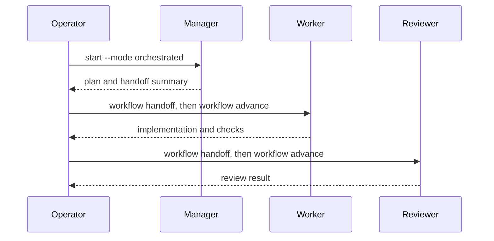

[English](README.md) | [日本語](README_ja.md)

# Flybridge

Flybridge は、単体エージェントと役割分離ワークフローを Orca 上で扱う制御プレーンです。workflow と競合資源の状態は決定的に管理し、外部 skill はパス指定で参照します。GitHub Project 連携は任意の読み取り専用候補抽出に限定されます。

- [仕様書](docs/specification.md)
- [アーキテクチャ](docs/architecture.md)
- [ADR](docs/decisions/)
- [skill・command catalog](docs/skill-and-command-catalog.md)


## 要件とセットアップ

- Python 3.11以上と [uv](https://docs.astral.sh/uv/) が必要です。CIではPython 3.11、3.12、3.13を検証します。最小versionは `requires-python` metadataを正とします。
- 稼働中のOrcaと、そのversionに対応したCLIが必要です。workflowを起動する前に `doctor` がruntimeへの到達性を確認します。
- workflowの対象repositoryにはGitが必要です。任意のGitHub Project候補抽出を有効にする場合だけ `gh` が必要です。

Flybridge は source checkout としての利用をサポートします。単一の配布packageは公開しておらず、`pip install flybridge` はサポート対象外です。

```bash
uv sync --all-packages
cp config/flybridge.ja.jsonc.example config/flybridge.jsonc
uv run --package flybridge-cli flybridge doctor
```

## 個人設定

ユーザー設定の入力は `config/flybridge.jsonc` だけで、`--config` は別の設定ファイルを選択します。Git 管理外のため、このマシンの絶対パスを書けます。

- `default_mode`: `single` または `orchestrated`。上書きできるのは `start --mode` / `doctor --mode` だけです。
- `state_dir`: workflow と queue の SQLite 状態を置くディレクトリ。
- `orca.executable`: 呼び出す Orca CLI コマンド。
- `orca.agents`: 各 role（`single` / `manager` / `worker` / `reviewer`）で起動するエージェント。
- `skills.sources`: 全 role で共有する skill の絶対パス。
- `skills.roles`: role ごとに追加する skill の絶対パス。
- `skills.response_language`: エージェントが応答する言語。
- `skills.language_specific`: その言語向けに注入する overlay 文書。
- `queue.observer`: root workflow で queue 監視ターミナルを開くか。`start --queue-observer` / `start --no-queue-observer` が上書きします。
- `queue.resources`: role prompt へ注入する排他資源の名前。
- `github`: 任意の読み取り専用 Project 候補抽出。使わない場合は `enabled` を false のままにします。

skill のパスには文書・catalog directory・glob を指定できます。directory は配下の `SKILL.md` をソート順に展開し、`~` と directory のシンボリックリンクは解決するため、マシンごとに実体が違う `~/projects/...` を共有できます。内容は対象リポジトリへコピーしません。

## コマンドと役割

`doctor` が Orca runtime へ到達できることを確認してから workflow を開始します。`doctor --mode` は指定 mode を検証し、省略時は `default_mode` を検証します。`start`、`workflow launch`、`workflow advance`、`workflow resume` も到達性を確認します。

```bash
uv run --package flybridge-cli flybridge doctor
uv run --package flybridge-cli flybridge start /path/to/repository --mode single --objective "Inspect and implement the task."
uv run --package flybridge-cli flybridge start /path/to/repository --mode orchestrated --objective "Inspect and implement the task."
```

同じ repository で同じ root objective が requested・開始中または実行中の場合、重複する開始は拒否されます。意図的な重複に限り `--allow-duplicate` を指定してください。同じ repository の異なる objective は妨げません。

orchestrated mode は `manager → worker → reviewer` の固定計画です。manager は計画と handoff の作成だけを担当し、実装・委任・agent 作成・入れ子の orchestration は行いません。開始時には manager を起動して child role を記録します。各 role の完了後、1行の handoff を記録してから manager workflow ID を指定して `workflow advance` を実行します。



```bash
uv run --package flybridge-cli flybridge workflow complete <manager-id>
uv run --package flybridge-cli flybridge workflow handoff <manager-id> <worker-id> --summary "Plan and scope are ready."
uv run --package flybridge-cli flybridge workflow advance <manager-id>
uv run --package flybridge-cli flybridge workflow complete <worker-id>
uv run --package flybridge-cli flybridge workflow handoff <worker-id> <reviewer-id> --summary "Implementation and checks are ready."
uv run --package flybridge-cli flybridge workflow advance <manager-id>
uv run --package flybridge-cli flybridge workflow complete <reviewer-id>
```

child role は直前 role のブランチから作成した新しい worktree で動作するため、次の role に渡るのは commit 済みの成果だけです。orchestrated の各 role prompt はこの前提を明示し、source worktree に未 commit の変更が残っている場合 `workflow advance` は失敗します。実装が review 前に失われることはありません。

role を完了できない場合は `workflow fail <workflow-id> --error "..."` を使用します。同じ role を再実行する場合は `cleanup` で external worktree を reconcile してから `workflow retry` を使用します。retry は失敗した実行が残した queue request を取り消してから durable record を `requested` に戻します。retried した single または manager は `workflow launch` で起動し、child role は `workflow advance` で起動します。ID は `start` と `workflow status` の出力に含まれます。

```bash
uv run --package flybridge-cli flybridge workflow status <workflow-id>
uv run --package flybridge-cli flybridge workflow resume <workflow-id>
uv run --package flybridge-cli flybridge workflow complete <workflow-id>
uv run --package flybridge-cli flybridge workflow cancel <workflow-id>
uv run --package flybridge-cli flybridge workflow retry <workflow-id>
uv run --package flybridge-cli flybridge workflow launch <workflow-id>
```

Flybridge は background service を起動しません。実行中 workflow の正確な Orca worktree と所有 terminal handle は、Flybridge 終了後も SQLite に保持されます。`workflow resume` は worktree を新規作成せず、保存済み worktree を検証して再利用します。agent terminal handle が有効ならそのまま使い、stale の場合だけ既存 worktree 内の agent terminal を1個置き換えます。workflow record は終了遷移後も履歴として SQLite に残り、cleanup は履歴を削除せず external ownership を reconcile します。

資源調整は operator と同じ CLI を使います。`queue.resources` に列挙した名前は、role prompt へ `flybridge --config <jsonc> queue acquire|inspect|release` と `--owner <workflow-id>` として注入されます。inspect と release には acquire 時と同じ owner が必要です。cancel、stale recovery、workflow 起動、cleanup は明示的な operator 操作です。`queue.resources` が空なら資源指示は注入しません。

queue observer は `flybridge` と同じ Python interpreter から起動するため、インストール後と `uv run` のどちらでも動作します。選択した JSONC path は quote された引数として渡されます。`queue.observer` で root workflow と同時に自動起動でき、`--queue-observer` / `--no-queue-observer` が JSONC より優先されます。

```bash
uv run --package flybridge-cli flybridge queue acquire heavy-check --owner <workflow-id>
uv run --package flybridge-cli flybridge queue inspect <request-id> --owner <workflow-id>
uv run --package flybridge-cli flybridge queue release heavy-check --lease <lease-id> --owner <workflow-id>
uv run --package flybridge-cli flybridge queue cancel --request <request-id>
uv run --package flybridge-cli flybridge queue recover --older-than-seconds 3600
uv run --package flybridge-cli flybridge queue status heavy-check
uv run --package flybridge-cli flybridge queue watch
uv run --package flybridge-cli flybridge queue observer --worktree-id <orca-worktree-id>
```

`board screen` の実行前に、`github.enabled` を `true` にし、owner、owner type、project number、field 名を設定して、その Project の read 権限を持つ `gh` を install・認証してください。このコマンドは設定した Todo と `github.priority_values` に該当する候補を表示するだけで、候補の選択・Project 更新・workflow 起動は行いません。

```bash
uv run --package flybridge-cli flybridge board screen
uv run --package flybridge-cli flybridge cleanup --dry-run
uv run --package flybridge-cli flybridge cleanup --apply --older-than-seconds 3600 --force-age
```

成功時の終了codeは0です。`doctor` はdependencyまたは指定modeの検査結果が不健全な場合に1、入力・設定・状態・adapter操作のエラーでは2を返します。`cleanup` は `--dry-run` または `--apply` が必須です。`--apply` は `--older-than-seconds` と `--force-age` も必須です。`--dry-run` に `--older-than-seconds` を追加すると、指定時間より古いrecordだけを表示します。

## 開発

```bash
uv sync --all-packages
uv run pre-commit install
uv run pre-commit run --all-files
uv run pytest tests
```

MIT license はルートの `LICENSE` です。package metadata は SPDX 識別子だけを持ち、独立した wheel としては公開しません。

CI は secret scan、公開 source の privacy audit、同じ pre-commit hook と test、および全 package の build を実行します。hook は Ruff とファイル衛生だけです。

## セキュリティ

脆弱性をpublic issueに報告しないでください。対応versionとprivateな報告方法は [`SECURITY.md`](SECURITY.md) に記載しています。
