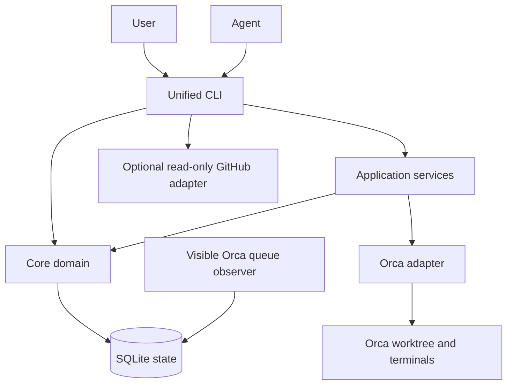
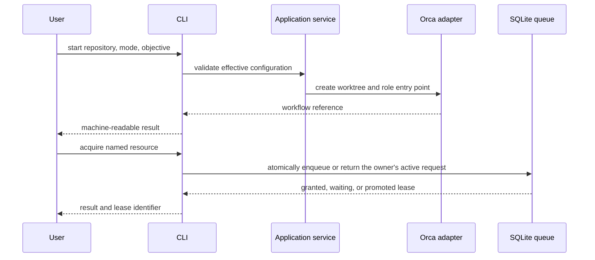
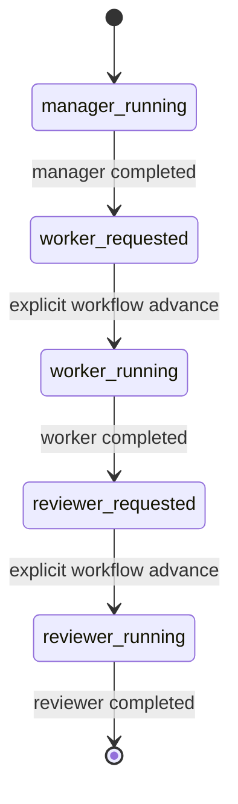

# Architecture

This document fixes the version 1 boundaries. The normative user-visible
behavior is in [the specification](specification.md); design choices are in
[the ADRs](decisions/).

## Layers and dependencies

| Layer | Owns | Must not own |
| --- | --- | --- |
| `core` | Configuration validation, workflow and resource-lease state, deterministic transitions | Orca or GitHub command syntax, subprocesses, prompt policy |
| application services | Use-case orchestration, role launch sequencing, input validation, adapter interfaces | Durable state format or vendor-specific commands |
| `orca` | Orca CLI invocation, worktree and terminal lifecycle | Queue policy or GitHub queries |
| `github` | Optional candidate screening from a Project | Selection policy or automatic dispatch |
| `cli` | Command parsing, output, exit status, resource-queue control, and composition of read-only GitHub screening | Business rules duplicated from `core` |

Dependencies point inward: workflow entry points use application services, while
simple state-oriented CLI operations may call core directly. Core never
imports an adapter. A future IDE adapter follows the same application-facing
interface as `orca`. The bounded `board screen` query has no application policy:
the CLI composition root directly constructs and invokes the read-only GitHub
adapter.

## Control flows

## Runtime ownership

Flybridge does not create a daemon. Agents and operators share the same CLI
against SQLite-backed queue state. The queue observer is an explicitly created
Orca terminal, and durable state lives in SQLite so it survives terminal
closure. `cleanup`
only reconciles Flybridge-owned stale records; it must never kill an unrelated
process. Adapter subprocesses use bounded execution and are waited for before
their caller exits.

Running records retain the exact Orca worktree ID, path, current agent terminal
handle, and any independent observer handles across Flybridge process exits.
Explicit resume verifies that worktree, reuses a live agent handle, or creates
one replacement terminal in the existing worktree. The core atomically swaps
agent ownership before the adapter sends the resume prompt; worktree creation
is outside the resume path.

## Deterministic role execution

The manager, worker, and reviewer are separate durable records. Parent-role
selection, handoff delivery, and the role order are application policy, not
entry-point or prompt interpretation. Each next role is created by
Flybridge as an Orca child worktree from the completed predecessor's branch;
the command returns after creation and does not run a scheduler or daemon.
Worktree ownership metadata is saved before lifecycle updates, enabling bounded
compensating cleanup if a later Orca call fails.

## Extension points

- Version 1 ships only the Orca adapter.
- GitHub integration is optional and screens candidates only. A human chooses
  whether a candidate starts a workflow.
- External skills remain outside this repository. Configuration supplies their
  paths and role assignments; prompts receive an English index of those paths.
- Single-agent and orchestrated workflows use the same `start` use case. Their
  role plans differ, but neither path bypasses configuration or state rules.
