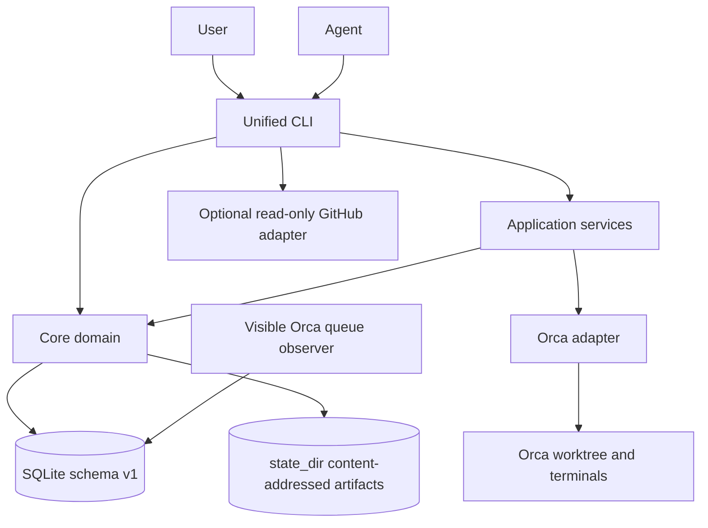
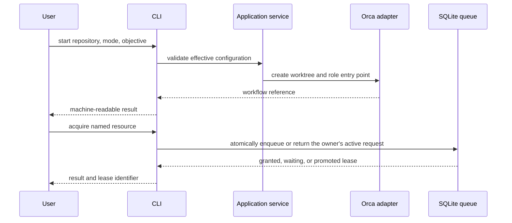
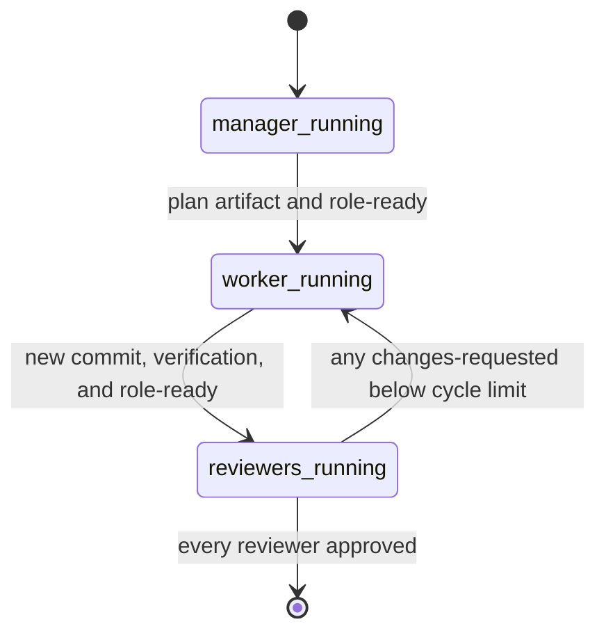

# Architecture

[English](architecture.md) | [日本語](../ja/architecture.md)

This document fixes the v1.0.0 state and orchestration boundaries. The normative user-visible behavior is in [the specification](specification.md); design choices are in [the ADRs](decisions/).

## Layers and dependencies

| Layer                | Owns                                                                                                             | Must not own                                                     |
| -------------------- | ---------------------------------------------------------------------------------------------------------------- | ---------------------------------------------------------------- |
| `core`               | Configuration validation, workflow and resource-lease state, deterministic transitions                           | Orca or GitHub command syntax, subprocesses, prompt policy       |
| application services | Use-case orchestration, role launch sequencing, input validation, adapter interfaces                             | Durable state format or vendor-specific commands                 |
| `orca`               | Orca CLI invocation, worktree and terminal lifecycle                                                             | Queue policy or GitHub queries                                   |
| `github`             | Optional Project listing, authored pull-request listing, and inventory pull-request facts                        | Selection policy, automatic dispatch, or local worktree matching |
| `cli`                | Command parsing, output, exit status, resource-queue control, read-only GitHub screening, and worktree inventory | Business rules duplicated from `core`                            |

Dependencies point inward: workflow entry points use application services, while simple state-oriented CLI operations may call core directly. Core never imports an adapter. A future IDE adapter follows the same application-facing interface as `orca`. The bounded `board screen` query has no application policy: CLI flags select boards and GitHub field values, and the GitHub adapter only pages Project items. Local worktree matching is outside workflow start; `flybridge inventory` is the one command that joins Orca paths to git and pull-request facts. `flybridge prs screen` lists authored pull requests without worktree matching. GitHub adapters use the configured `github.login` token.

## Control flows

## Runtime ownership

Flybridge does not create a daemon. Agents and operators share the same CLI against SQLite-backed queue state. The queue observer is an explicitly created Orca terminal that can deliver a lease-grant prompt after FIFO promotion; it never changes queue order. Durable state lives in SQLite so it survives terminal closure. `workflow cleanup` reports Flybridge-owned stale records and finished roots that still own child worktrees; leftover children are retired, not age-applied. It must never kill an unrelated process. Adapter subprocesses use bounded execution and are waited for before their caller exits.

The unified `flybridge.sqlite3` state database requires SQLite WAL mode. A filesystem that cannot enable WAL is rejected rather than silently using rollback journaling. This keeps multiple CLI and observer processes from depending on filesystem-specific lock behaviour.

Schema version 1 relates runs, steps, dependencies, immutable agent-run snapshots, Orca worktrees, repository checkouts, external references, operations, and FIFO requests. Workflow termination, successor cancellation, queue release, and promotion share one transaction. Legacy `workflows.sqlite3` and `queue.sqlite3` files are never converted or deleted automatically.

There is no reconciliation daemon. Workflow commands first perform a lightweight complete Orca scan; list and status fall back to stored facts with freshness and error metadata, while mutations fail closed. Explicit `flybridge reconcile` also probes git checkouts. A successful, non-truncated scan is the only missing worktree evidence. Two misses separated by at least 300 seconds cancel managed steps; failures, partial results, and truncation do not advance that evidence.

Running records retain the exact Orca worktree ID, path, current agent terminal handle, and any independent observer handles across Flybridge process exits. Explicit resume verifies that worktree, reuses a live agent handle, or creates one replacement terminal in the existing worktree. The core atomically swaps agent ownership before the adapter sends the resume prompt; worktree creation is outside the resume path.

An orchestrated record persists three independent identity facts: `implementation_repository` is the GitHub `nameWithOwner`, `runtime_repository_id` is parsed from the full Orca worktree ID and selects the repository for child creation, and `start_sha` anchors pristine-manager, worker-commit, and ancestry checks. This separation is preserved for `--attach-existing` roots and all children.

## Deterministic role execution

The manager, worker, and reviewer are separate durable records. Parent-role selection, handoff delivery, role order, review-cycle limits, and readiness consumption are application policy, not prompt interpretation. One coordinator terminal runs the restart-safe supervisor loop. A role stores its role-owned artifact and records `role-ready`; the supervisor verifies the artifact digest, repository identity, and Git state before completing it and launching the child. Transitions are replay-safe because readiness is consumed only after the successor is known to be running.

Artifacts are private, bounded UTF-8 files under `state_dir/artifacts/workflows/<manager-id>/`. Their names include the SHA-256 of their content and SQLite v4 stores the digest, size, owner, and relative path. The manager must remain at `start_sha`; only worker implementation commits cross into reviewer worktrees. A requested-changes review is injected into the reused worker and requires a commit newer than the reviewed SHA.

The coordinator is durable ownership, not a daemon. At a terminal run outcome it records completion, failure, or blocking, releases its own handle from active ownership, prints and flushes the result, and then self-closes its terminal. Operator cleanup can close an inactive tab if self-close fails. Manual `proceed`, `handoff`, and `advance` exist only for recovery and diagnosis.

## Extension points

- The current release ships only the Orca adapter.
- GitHub integration is optional. `board screen` lists Project issues only; a human chooses whether an issue starts a workflow. `--with-refs` joins those issues to local worktrees and GitHub development facts by canonical issue URL sets and development refs in the application layer. `prs screen` lists authored pull requests without worktree matching. `inventory` may query open, merged, closed, and hinted pull-request facts by parent and submodule repository without dispatching work. Filter values are CLI flags.
- External skills remain outside this repository. Configuration supplies their paths and role assignments; prompts receive an English index of those paths.
- Single-agent and orchestrated workflows use the same `start` use case. Their role plans differ, but neither path bypasses configuration or state rules.
