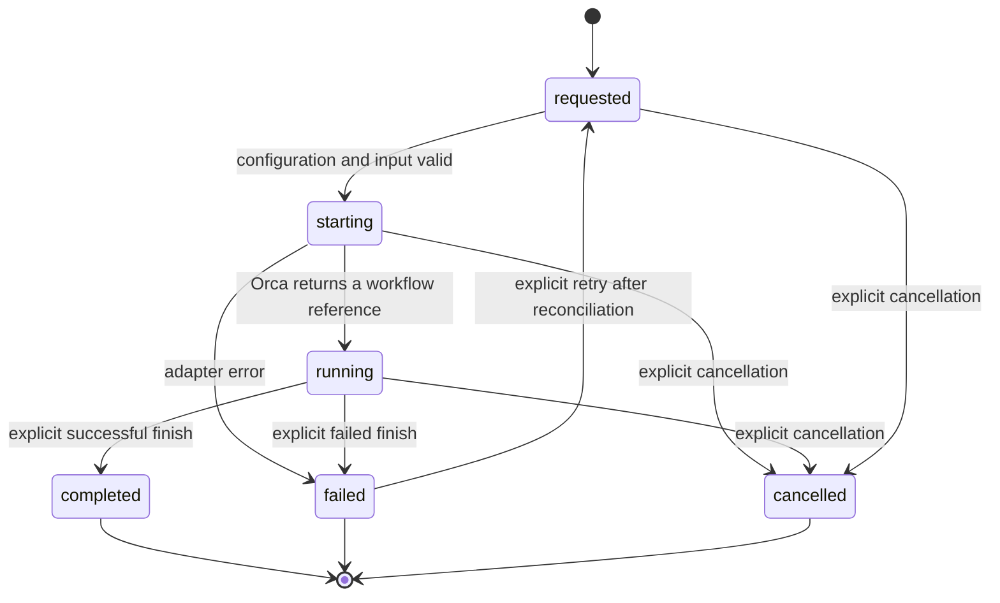
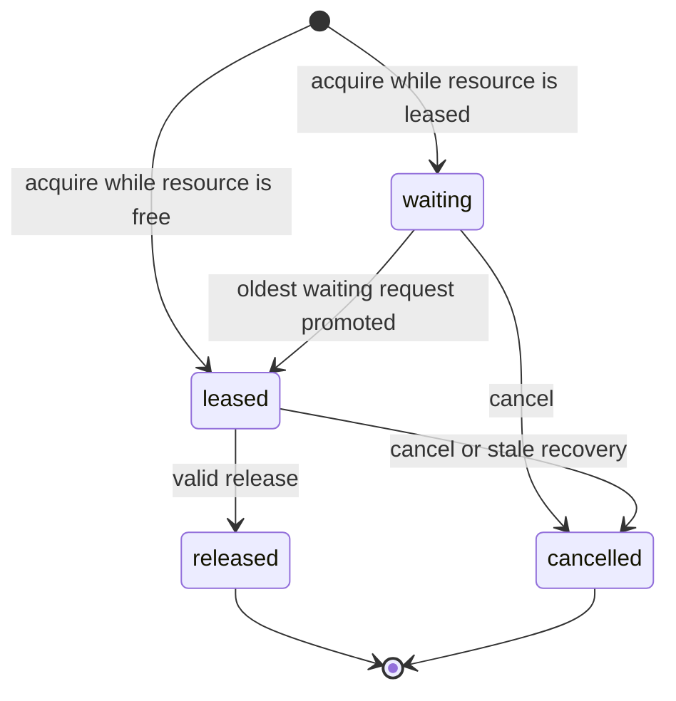

# Flybridge v1.0.0 specification

[English](specification.md) | [日本語](../ja/specification.md)

## Purpose and scope

Flybridge starts and observes Orca-native software-development workflows. It supports a single-agent mode and a role-separated mode, optional manual selection from a GitHub Project, a read-only Orca worktree inventory, external skill indexes, and deterministic exclusive-resource coordination.

Version 1.0.0 does not support another IDE, board-driven operation as a requirement, automatic prioritization, autonomous issue selection, configuration from the environment, or copying private skill content into a repository.

## Configuration contract

- The effective user configuration is one JSONC file passed with `--config`, defaulting to `config/flybridge.jsonc`.
- Only `workflow start --mode` and `doctor --mode` override `default_mode`, and only `workflow start --queue-observer` / `workflow start --no-queue-observer` override `queue.observer`. Other command-line arguments are operation inputs rather than overrides for JSONC fields. Environment variables and XDG configuration locations are not configuration inputs.
- English and Japanese example configurations are committed. A user's configuration and its absolute skill paths are ignored by Git.
- Runtime state uses the configured state directory. Its default is an XDG state location, but that location never supplies user configuration. SQLite state and content-addressed workflow artifacts under this directory use private permissions.
- A skill path may be a document, a catalog directory, or a glob pattern. `~` is expanded and directory symbolic links are resolved. Catalog directories expand recursively to sorted `SKILL.md` documents. Glob matches and resolved documents must exist before an Orca workflow is started. A catalog entry that resolves outside its configured root is rejected.
- `skills.sources` and role-specific paths are absolute. They are combined in that order with duplicate paths removed. `skills.operator` is a separate absolute-path list for the parent operator; it does not affect role prompts or workflow records.
- `operator guide` validates and prints only the configured Operator document index and response language. It never prints private document content. Its concise instruction makes the Operator decide workflow-wide constraints once, pass the resulting decision and validity to roles, pass direct source URLs for issue or review facts, and withhold lifecycle completion until required verification is evidenced, including requested proof and kicking hosted CI when a source asks for those, not code inspection alone. Hosted CI is complete once triggered; do not wait for its result. The Operator classifies failed hosted checks from their logs and retries an authorized transient service or infrastructure failure instead of assigning unnecessary code work.

## Workflow contract

- A start request has a repository, a mode, a name, and an English objective.
- `single` starts one agent role. `orchestrated` creates the fixed durable plan `manager`, then `worker`, then `reviewer`; Flybridge rather than an LLM decides this order.
- The manager prompt permits planning only. It explicitly forbids implementation, repository changes, agent creation, delegation, nested orchestration, and manual lifecycle commands. The plan is a `state_dir` artifact, not a commit.
- Every orchestrated role stores its role-owned artifact (`plan`, `verification`, or `review`) and calls `workflow role-ready`. Readiness is idempotent, keeps the role terminal open, and snapshots the verified artifact digest and content. A durable coordinator completes the source and launches the planned successor. A single role writes no workflow artifact and never calls `role-ready`; it reports its result or blocker and stops so the operator can verify and finish it.
- Role prompts separate decisions from source facts. A role follows an Operator's workflow-wide decision while its stated scope and validity apply, but reads cited issue, pull-request, and review-comment URLs itself before deciding scope or requested changes. Successor handoffs carry the conclusion, scope, validity, and direct source URLs instead of replacing sources with summaries.
- Reviewer start and resume prompts query `workflow_refs` for their run. They list only explicitly registered `primary` or `related` issue and pull-request URLs; inferred candidates remain screening data. Reviewers must read every issue body/discussion and PR description/discussion/review/inline comment directly before reviewing. Objective text and artifacts cannot introduce additional review sources.
- The manager defines acceptance criteria, required verification, and prerequisites. Criteria may include requested evidence and kicking hosted CI, not code diffs alone. Hosted CI is complete once triggered; do not wait for its result. The worker collects evidence for every criterion, the reviewer maps evidence to those criteria, and a single role performs both implementation and self-review. Workers and single roles inspect repository guidance and CI configuration and run every locally reproducible required check on the final tree, including all-files checks used by CI. Missing data, access, or environment is a blocker: a role must not substitute a narrower check or claim successful readiness. An orchestrated role records verified and unverified scope in its required artifact and declares blocked readiness; a single role reports the blocker to the operator without claiming completion.
- An orchestrated start launches the manager, persists requested child records and an orchestration run, and creates one coordinator terminal. The coordinator polls durable readiness, verifies its artifact and Git state, records the handoff, completes the source, and launches exactly the next eligible child. It consumes readiness only after a replay can observe the successor running.
- An approved readiness from every configured reviewer completes the run. Any `changes-requested` report removes those reviewer worktrees, injects every review artifact into the existing worker, and requires a new worker commit before review repeats. The positive `orchestration.max_review_cycles` setting bounds this loop; reaching it blocks the run with a durable error.
- Manager, worker, and reviewer may use `role-ready --outcome blocked` after their required artifact records verified and unverified scope. Repository gates still apply. The coordinator closes the blocked role, cancels requested successors, and atomically consumes the blocker while marking the run blocked. Status exposes the structured blocker separately from reviewer approval or changes-requested outcomes.
- Transient coordinator failures persist an error count and retry timestamp in the run. `orchestration.max_coordinator_errors`, `retry_initial_seconds`, and `retry_max_seconds` bound exponential backoff across supervisor restarts.
- `workflow coordinator-retry ROOT_ID` is an operator-only hot-upgrade and crash-recovery control. It closes a still-live stale coordinator, CAS-resets eligible blocked/failed run metadata, and starts current coordinator code without changing role or readiness records. Completed runs, consumed declared blockers, and consumed maximum-cycle outcomes remain terminal. An unconsumed blocker from the same run is explicitly replayable.
- The manager must remain at its recorded `start_sha`. Because reviewer worktrees are created from the worker branch, only committed implementation reaches review. Worker readiness rejects an unchanged HEAD or uncommitted changes.
- Before a child is launched, its required single-line handoff summary is included in the English prompt. A missing or mismatched handoff prevents the Orca create operation. Completing the predecessor without that recorded handoff is also rejected.
- The command returns structured output containing the workflow reference and fails non-zero without a partial local workflow record if preflight fails.
- An Orca reference is the complete worktree ID returned by Orca, not merely a local path. Workflow identity separately stores the GitHub implementation repository, the Orca runtime repository ID parsed from that reference, and the starting Git SHA. Child creation selects the runtime ID; readiness, resume, and review-cycle transitions verify all persisted identities.
- Flybridge persistently records the complete Orca worktree ID, path, and startup terminal handle before it updates Orca lifecycle metadata. If that update fails, it closes the exact owned worktree terminals and retains the failed record.
- `workflow resume <workflow-id>` accepts only a persisted `running` record. It verifies the complete recorded worktree ID with an exact ID selector and never creates a worktree. A valid recorded agent terminal is reused; a stale or missing handle is replaced once in that existing worktree. Presets with `prompt_arguments` receive the resume prompt in the launch command; other presets use bounded TUI-idle confirmation and prompt injection. A timed-out command launch is reconciled only when an exact unique title identifies its terminal in the recorded worktree. The replacement atomically supersedes stale agent ownership without affecting separately owned observer terminals. When `queue.observer` is true, resume enables the persisted observer policy and re-attaches a queue observer. `--no-queue-observer` remains a `workflow start` override only.
- A root start is rejected when the same resolved repository and objective already has a `requested`, `starting`, or `running` root, unless `--allow-duplicate` is explicit. Different objectives in one repository remain independent.
- Default workflow names combine sub-second time and a random suffix so concurrent generated names do not depend on second-level clock precision. Active workflow names (`requested`, `starting`, `running`) are unique; cancelled, failed, and completed names may be reused after their external ownership is reconciled. Launch rejects an unreconciled prior owner with the cleanup command before allocating another external agent.
- `-o @path` and `--objective-file PATH` read the objective from a UTF-8 file. The prompt receives that file's contents, never the path string. `workflow start --batch` uses the same helper for each item's `objective_file`. The run also stores the resolved absolute source path and SHA-256; direct objectives store no source path.
- `workflow list [--status ...] [--json]` prints workflow rows with `id`, `name`, `status`, `role`, `mode`, `repository`, `worktree_path`, `adapter_reference`, `updated_at`, `owns_worktree`, `queue_observer_enabled`, `owner_terminal_valid`, and `observer_stop_reason`. `workflow observe` requires a live owner agent terminal and otherwise exits 2, telling the caller to `workflow resume` first. Successful observe persists `queue_observer_enabled`. Rows retain `id` as the compatible step identifier and add `run_id`. Status accepts either the run root or a step identifier.

### Reconciliation and linked state

- `flybridge reconcile [--dry-run] [--no-github]` observes all Orca worktrees outside a database transaction, then applies one completed scan. External worktrees are registered as `unmanaged`; only explicit attach grants ownership. `reconcile.exclude_worktrees` omits matching directory names or globs from the observation set; a successful non-truncated scan deletes matching non-managed worktree rows.
- Creation comments contain a machine-readable run/step marker. A later scan may attach a marker-bearing worktree to its still-`starting` step after a crash.
- Orca status is observational and never turns a Flybridge step into success or failure. Missing cancellation requires the configured consecutive observation count and grace period. Reappearance clears pending evidence but never revives a terminal workflow.
- Main, submodule, and explicitly related repositories are separate checkout relations and include commit SHA; detached HEAD is valid. Use `worktree repository add|remove`, where removal applies only to `related` rows.
- `workflow link|unlink` manages explicit primary/related issue or pull-request references. The identifier may be a run id or a workflow step id. At most one explicit primary of each reference kind exists per run; inferred candidates are never promoted automatically.
- `workflow start --batch <file.json>` is exclusive with the repository argument. It runs sequential `--attach-existing` starts, continues after item failures, prints `{ok, failed, results[]}`, and exits `2` when any item failed. Each item requires `path` (or alias `repository`), `objective` or `objective_file`, and may set `mode`, `name`, and `issue`. Specifying both `path` and `repository` with different values is an error.
- `workflow proceed`, `handoff`, and `advance` are operator-only recovery controls. Autonomous orchestration does not require them. Agents must not run manual lifecycle commands.
- `workflow status` includes orchestration run state, current and maximum review cycles, coordinator release metadata, child records, artifact metadata, and a read-only `progress` object. `progress.stage` is `planning`, `implementing`, `reviewing`, `addressing_review`, `waiting`, `waiting_resource`, `completed`, `blocked`, or `failed`. `progress.roles` is always resolved from the root manager. `progress.readiness` lists every role-ready summary in cycle order without artifact bodies. A parked manager may answer operator progress questions from this JSON; it does not change lifecycle state. After every reviewer approves the same SHA, the coordinator harvests into the manager worktree, requires `delivery-check`, fast-forward pushes once, and retires owned worker and reviewer worktrees with `--keep manager`. After a `completed`, `blocked`, or `failed` run it harvests remaining worker commits when possible and retires those children the same way. A single-mode agent pushes itself after local verification. A parked manager or parent agent may still run `workflow harvest` then `workflow retire --keep manager|none` when `cleanup --dry-run` reports `retire_recommended`, or to close the manager with `--keep none`. `--keep none` also closes manager terminals and removes a manager worktree only when Flybridge owns it; attached existing worktrees are never removed. Harvest and retire do not change workflow lifecycle status. Operator harvest is refused while the orchestration is still `running` unless every reviewer has already approved the same SHA. At `completed`, `blocked`, `failed`, or `delivery_failed`, the coordinator durably records the outcome and releases ownership, flushes its result JSON, and then closes its own terminal. Operator cleanup may close an inactive tab left by a failed self-close.
- Workflow records are retained in SQLite after terminal states for audit and retry history. Cleanup closes or removes recorded external ownership and atomically marks it reconciled with any required cancellation; it does not delete workflow history. Attached existing worktrees are never removed. Cancelling or failing a non-owning attached workflow marks its adapter reference reconciled immediately; owning worktrees stay reserved until cleanup. `workflow cleanup --apply` continues after a per-workflow failure, records those errors, and accepts `--workflow <id>`. A lifecycle claim older than the operator-supplied cleanup age can be taken over after a crashed process, while a newer claim is never disturbed.
- Completing, failing, or cancelling a running workflow updates Orca metadata before the corresponding local terminal state is committed, then closes every terminal owned by that exact worktree. Role agents must not invoke those commands; doing so ends the agent that is still supposed to report a handoff.
- Orca's default board statuses distinguish active from inactive workspaces: `running` maps to `in-progress`, and every terminal Flybridge state maps to `completed`. The Flybridge record and the Orca worktree comment retain the distinct `completed`, `failed`, or `cancelled` outcome.
- Cancelling a requested or starting role also cancels requested successor roles. A failed role can return to requested only through explicit retry after its external ownership has been reconciled. Retry cancels queue requests left by the failed execution before making the workflow requested again. `workflow launch` starts a requested single or manager root. Requested child roles start through `workflow advance`.
- `workflow start`, `workflow launch`, `workflow advance`, and `workflow resume` fail closed when the live Orca runtime is not reachable.
- If Orca allocates a worktree but returns an incomplete start response, Flybridge preserves the exact returned identity and performs bounded compensating cleanup; a cleanup failure remains explicitly recoverable.
- Before a workflow record or worktree is created, Flybridge detects `.gitmodules` and runs `git submodule update --init --recursive --checkout` with `GIT_LFS_SKIP_SMUDGE=1` and repository hooks disabled. The explicit checkout mode overrides a custom local submodule update strategy. This defensive operation is skipped only for repositories that do not declare submodules, and for `--attach-existing` starts.
- `orca.agents` values are a TUI id string, an object `{agent, model}`, or for `reviewer` a non-empty list of those forms. `model` may be `null` to use the agent's current default. Duplicate agent/model pairs are allowed. New worktrees pass a TUI id to `worktree create --agent` only when no model is set or the selected preset lists the model in `builtin_models`. Other starts allocate the worktree without a TUI id and launch the preset command in a terminal. Presets with `prompt_arguments` receive the initial prompt in the launch command and do not use TUI readiness or prompt injection; other presets wait for TUI-idle and send the prompt. Flybridge-owned observer and coordinator terminal commands start through `/bin/sh` so the same quoted argv works when Orca's interactive shell is zsh.
- Agent executable aliases and arguments are data, not Python constants. The tracked package preset is `flybridge_core/agent-launch-presets.json`; it defines Cursor, Codex, Ollama, and fallback commands. `orca.launch_presets` may select another tracked JSON document. `orca.launch_overrides` selects an optional local document whose named entries replace packaged entries; by convention `config/agent-launch-overrides.json` is ignored and its tracked `.example` is the template. The packaged Cursor preset deliberately uses its explicit CLI command so `--trust --yolo` is applied instead of relying on an Orca built-in launch that can stop at workspace trust. An override may opt back into a built-in TUI. `doctor` resolves every effective command without launching an agent.
- `workflow start --attach-existing` resolves the Orca worktree already checked out at the repository path and starts a new agent in it. When a `running` Flybridge workflow already owns that worktree, the same workflow ID is kept, `-o` replaces the recorded objective, and the replacement agent receives a start prompt (not a resume prompt) for that role and mode. When the only owner is an unreconciled `cancelled`, `failed`, or `completed` record, Flybridge marks that ownership reconciled without removing the worktree and then attaches a new non-owning root. Omitting `-m` forces `single` (config `default_mode` is ignored). Queue observer startup follows `queue.observer` unless `--queue-observer` or `--no-queue-observer` is passed, the same as a new start. It never runs `worktree create`, skips submodule initialization, and never removes the attached checkout.
- An attached orchestrated root records its implementation repository and Orca runtime repository as separate identities. Its worker and reviewer children are created in that persisted runtime repository, not by interpreting the GitHub `nameWithOwner` as an Orca selector.
- Before a workflow record or worktree is created, Flybridge idempotently registers the target repository with Orca. Registration failure leaves no local workflow record.
- Prompts are English. A configured response-language string is interpolated only as data, for example `Japanese`; it does not change the prompt template's language.
- Resume prompts concisely restore the original objective and role plus the currently configured response language, applicable skill paths, and resource coordination context.
- A prompt receives a local document index, never the contents of private skill documents. The agent is instructed to read applicable documents at those paths and not copy their contents into a repository without user direction.
- Every role required by the selected mode has an explicitly configured Orca agent. Flybridge does not silently choose an agent.

## Resource queue contract

For each resource name, Flybridge maintains a durable first-in, first-out queue. A request is identified by a generated request identifier and its workflow owner ID.

- Acquisition, release, cancellation, promotion, and event recording occur in one SQLite transaction.
- A release or cancellation promotes exactly the oldest waiting request for the same resource.
- A lease identifier is required to release a lease. An invalid or mismatched identifier is an error and cannot affect another request. CLI acquire accepts only a running workflow owner. CLI release and inspect require that owner.
- Every acquire result includes a request identifier so an unleased waiting request can be cancelled. A lease identifier is present only after a grant.
- Repeating acquire for the same resource and active owner returns the existing request instead of adding a duplicate waiter.
- Stale recovery remains available to operators (`queue recover` still uses `queue.lease_timeout_seconds`, default 3600). The durable supervisor does not expire healthy waiters. `queue.wait_timeout_seconds` stays in JSONC for compatibility and is unused by the supervisor. The supervisor expires a lease only when its owner is not running or its terminal is invalid, then promotes the next waiter. Role activations older than `timeouts.role_seconds` (default 3600) are blocked while commits are kept, except while the role is queued or has unconsumed `role-ready`. Grant and release refresh `activated_at`. Agents do not poll for expiry.
- The observer prints queue events and current counts in a visible Orca terminal. It cannot change queue ordering. When started with `--notify-workflow`, it also delivers a lease-grant prompt to that workflow's agent after a waiting request is promoted. Immediate grants are not re-notified. `--once` remains display-only. A notifying observer closes its Flybridge-owned terminal when its original owner terminal is no longer valid; transient Orca lookup errors do not stop it, and observer exit never releases or cancels a queue request.
- `workflow status` reports the persisted observer policy, owned observer handles, owner-terminal validity when Orca is reachable, and the most recent Flybridge-observed termination. An observer stopped outside Flybridge is not a definitive live-state change unless Orca reports the owner terminal invalid.
- A root, launched, or advanced workflow opens the observer when enabled in JSONC or by CLI override on `workflow start`. Observer startup failure marks that workflow failed and closes its recorded owned terminals. Resume follows current `queue.observer` configuration rather than the flag recorded at first launch.
- Callers name a resource for any mutually interfering process; the queue does not encode a special category such as verification.
- Configured resource names are included in role prompts with CLI acquire and release commands, including `--config` and `--owner`. A waiting caller reports its request identifier and stops. The observer names the lease identifier after FIFO promotion. CLI inspect and release require the durable request owner.
- `queue.resources` is the prompt-injection list of names agents should coordinate. The queue itself accepts any resource name.
- Queue connections use a bounded SQLite lock wait so short CLI contention does not silently violate FIFO ordering.

## GitHub and queue contracts

- GitHub support is disabled unless the JSONC configuration enables it. When enabled, configuration supplies a GitHub `login`, optional `skip_repositories` prefixes, and one or more Project boards (owner, owner type, number, and Status/Priority field names). `github.login` is the GitHub CLI account Flybridge uses: adapters resolve `gh auth token --user` for that login and set `GH_TOKEN` on child `gh` processes without switching the host active account. `flybridge doctor` reports configured versus active logins and fails when the configured login is not authenticated. `flybridge board screen` lists issues from those boards. `--assignee` defaults to `github.login`; `--all-assignees` disables assignee filtering. `--status`, `--priority`, and `--board` are optional CLI filters and are not stored in configuration. `--with-refs` attaches matching Orca worktrees by the set of canonical issue URLs (worktree comment, same-repo linked issue, and issue body URLs) plus GitHub development refs (connected pull-request heads and linked branches, including submodule checkouts under a parent worktree). Submodule repositories are not reported as separate worktrees. Unmatched selected checkouts appear in `unmatched_worktrees`. `--path-prefix`, `--exclude-prefix`, and `--exclude-name` filter those checkouts the same way as `inventory`. Development facts are fetched in bounded GraphQL batches (board issue URLs plus one hop of worktree comment issue URLs) so large boards do not issue one GitHub CLI call per issue. The command never selects an issue, mutates Project data, starts work, or classifies an issue as unstarted. Unreadable status or priority values skip that item when the corresponding filter is set; they do not abort screening. Directory names are not used as issue identifiers.
- `flybridge prs screen` is a read-only authored pull-request listing. It does not join Orca worktrees. `--author` defaults to `github.login`. Repeatable `--state OPEN|MERGED|CLOSED` values are OR filters; the default is `OPEN`. `--with-review-facts` uses the same eligibility rules as `inventory`. The command reports facts only and does not interpret comments as blockers or emit mergeability verdicts. Thin rows include `author`, `base_ref_name`, `base_ref_oid`, `base_ref_tip_oid`, and `base_ref_stale`. Agents that need authored pull-request facts must run this command with the same `--config`; they must not write one-shot collectors unless the command itself failed.
- `flybridge prs refresh-base <owner/repo> <number>` PATCHes the recorded base branch name so GitHub recomputes the pull-request base onto the current tip. Inventory and `prs screen` never mutate GitHub.
- New `workflow start` requires `--issue` with a canonical GitHub issue URL. `--attach-existing` may omit it when the Orca comment already contains that URL. Orchestrated child roles inherit the root `issue_url`. The URL is stored on the workflow record and in the Orca worktree comment; lifecycle comment updates preserve issue URL lines. Start, resume, and replacement-agent prompts identify it as the primary issue and require the role to read its relevant discussion directly.
- `flybridge inventory` is a read-only facts snapshot. It lists Orca worktrees from `worktree ps`, inspects each checkout with git, and when GitHub is enabled and `--no-github` is not set, batches open pull-request queries by parent and submodule GitHub repository and matches them to those branch heads. Checkouts with no open match also receive a bounded query for `OPEN`/`MERGED`/`CLOSED` heads, and an Orca hinted pull-request number is fetched regardless of state. Repeatable `--path-prefix`, `--exclude-prefix`, and `--exclude-name` flags filter by resolved filesystem path or directory name. When an `--exclude-prefix` does not exist, it also matches worktrees whose path contains that prefix's final directory name, so an Orca workspace prefix still excludes a same-named checkout elsewhere. `--exclude-name` applies even when a same-named prefix path exists. `--with-review-facts` cannot be combined with `--no-github`. It fetches review, comment, and thread bodies for unique matched `OPEN` pull requests that are not drafts and have no pending or queued checks. Eligible rows gain `review_facts`; other matched rows stay thin. Each author includes `is_bot` from the GitHub Actor (`Bot` type, `resourcePath` under `/apps/`, or a `[bot]` login). The command still does not interpret comments as blockers or emit mergeability verdicts. Thin pull-request rows also report `author`, `base_ref_name`, `base_ref_oid`, `base_ref_tip_oid`, `base_ref_stale`, `matched_from` (`parent` or `submodule`), and `checks[].is_required` when GitHub returns it. Hosted GitHub currently rejects `isRequired` on status-check rollup queries, so that field stays `null` in collected facts. A review-facts query failure is recorded per pull request in `failures` and does not omit other rows. GitHub query failures for repositories that no selected worktree uses are omitted. The flags are not stored in configuration. The command does not write workflow state, start agents, mutate GitHub data, or emit mergeability verdicts. Orca `github_hint.issues` lists `{repository, number, url}` from the comment and from a same-repo linked issue; `github_hint.pull_request` remains Orca metadata. Head matching on the parent and each submodule is the source of truth for `pull_requests`. A successful Orca list still prints JSON with per-row `errors` and top-level `failures` for partial collection problems. A GitHub query failure for one repository does not omit pull-request facts collected for other repositories. When GitHub is enabled and `--no-github` is unset, selected-repository GitHub failures (including a total query exception) return exit status 2 after that JSON. Transient HTTP 502/503/504 after one retry are `warnings` and keep exit status 0. `github.skip_repositories` prefixes are omitted from queries, `failures`, and work-target errors. Git probe failures on a single worktree stay on that row and do not by themselves change the exit status. `--no-github` and disabled GitHub still return 0. An unreachable Orca runtime or invalid configuration returns exit status 2. When GitHub is disabled or `--no-github` is set, the `pull_requests` field is omitted.
- Resource acquire, inspect, release, status, and watch are CLI operations. Agents acquire and release; they do not poll. Operators and observers share the same durable queue.
- Cancellation and explicit stale recovery are operator-only CLI operations. Workflow termination cancels active requests whose owner is that workflow ID or is no longer a known workflow.
- GitHub integration may not mutate configuration or create a persistent Flybridge service.
- `workflow cleanup` reports active Flybridge records, unreconciled failed or cancelled worktree records, and finished orchestrated roots that still own unreconciled child worktrees. Bare `workflow cleanup` is a dry-run. Its dry-run includes each candidate's recorded status, last update, and Orca reference. Leftover children set `retire_recommended` and `root_id`; they are closed with `workflow retire --keep manager`, not `--apply`. Applying age-based cleanup requires an explicit `--older-than-seconds` threshold; `--force-age` is implied when that threshold is passed because age alone is not a liveness signal; it closes recorded owned terminals, removes only the exact persisted Orca worktree reference, then atomically marks that external ownership reconciled and records cancellation when applicable. Failed-start records remain failed for diagnosis after their owned worktree is reconciled. It never scans for or kills unrelated system processes.
- `workflow harvest` copies worker commits into the manager worktree of a finished orchestration (`completed`, `blocked`, or `failed`), or of a still-running run whose reviewers have all completed on the same SHA. For an approved tip, every reviewer worktree must record the same starting SHA, and harvest refuses worker commits added after that locally approved SHA. It fast-forwards when the manager HEAD is an ancestor of the worker commit and otherwise merges; a dirty worktree or merge conflict fails closed without deleting resources. If the worker path is no longer a git worktree, harvest skips with `worker_worktree_gone` instead of failing identity verification. A present worktree whose Git identity does not match stays fail-closed.
- `workflow delivery-check ROOT_ID...` is the read-only pre-push gate. It succeeds when every reviewer reviewed the same SHA and the harvested manager HEAD exactly matches that SHA. The coordinator uses this gate before a fast-forward push from the manager worktree (`delivery.orchestrated` is `manager_worktree`; force push is rejected). Blocked or failed runs, an unharvested manager, and a tip changed after approval return status `2` for the operator command.
- `workflow retire --keep manager|none` runs harvest first, then closes owned worker and reviewer terminals and worktrees. A harvest skip for a gone worker still closes those children. `--keep none` also closes manager terminals and removes the manager worktree only when `owns_worktree` is true. Attached existing manager worktrees stay. Both commands accept multiple ids, continue after per-id errors, and do not delete SQLite history.

## Failure, observability, and privacy

- CLI commands emit JSON for successful machine-readable results and a concise error to standard error on failure. `flybridge inventory` is an exception: selected-repository GitHub collection failures still print the facts JSON on standard output and then return exit status 2. Transient HTTP 502/503/504 after one retry are `warnings` and keep exit status 0. Configured `github.skip_repositories` are omitted from queries and from `failures`. Adapter failures include the invoked operation without leaking configured private paths beyond the local caller.
- State directories and SQLite files use private permissions where the platform supports them. Skill paths reject unsafe control characters. Catalog expansion refuses documents that resolve outside the configured root.
- Every queue state transition produces a sequence-numbered event.
- Event readers page through bounded batches, and state retains the latest 10,000 events so long-lived observers and databases remain bounded.
- Public CI audits tracked UTF-8 source for legacy organisation/person names, identifier and separator variants, Unicode-normalized forms, and known local workspace paths. Undecodable or NUL-containing tracked files fail closed. The audit and its regression tests remain in the history-free public tree.
- Prompts, documentation, examples, and committed source contain no private skill content or private repository paths.

## Acceptance criteria

1. A fresh clone can use an example configuration as a template and run `doctor`, single mode, and orchestrated mode with Orca available.
2. Single and orchestrated starts both create durable workflow records and return their references. Orchestrated manager, worker, and reviewer complete autonomously after role readiness without operator proceed.
3. Queue ordering, cancellation, stale-record recovery, and observer output are covered by automated tests.
4. GitHub screening is optional and cannot dispatch work automatically. Inventory JSON is covered by automated tests and does not dispatch work.
5. Independent CLI queue callers share one durable FIFO; inspect reports promotion after another owner releases.
6. Closing a client leaves no Flybridge-owned background process; cleanup can report and reconcile stale Flybridge records.
7. Real-Orca acceptance is excluded from automated tests and requires both `--apply` and `FLYBRIDGE_REAL_ACCEPTANCE=1`. On an explicitly provisioned machine it uses disposable state and repository data to verify attach-existing child repository identity, state-only artifacts, no manager plan commit, autonomous completion, durable outcome, post-flush coordinator self-close, and fallback cleanup. `scripts/test.py` must mock the Orca CLI runner and agent PATH resolution (`which`); it must not launch Orca or an LLM, or require `orca-ide`, `codex`, or `cursor-agent` on PATH.
8. Formatting, linting, tests, and the public-release audit pass before the repository is made public.
