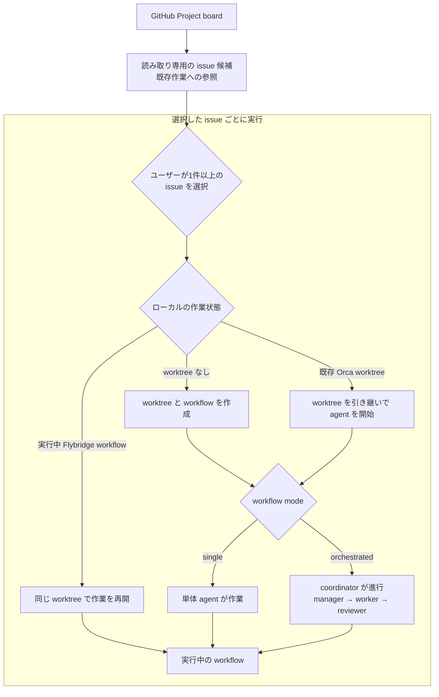
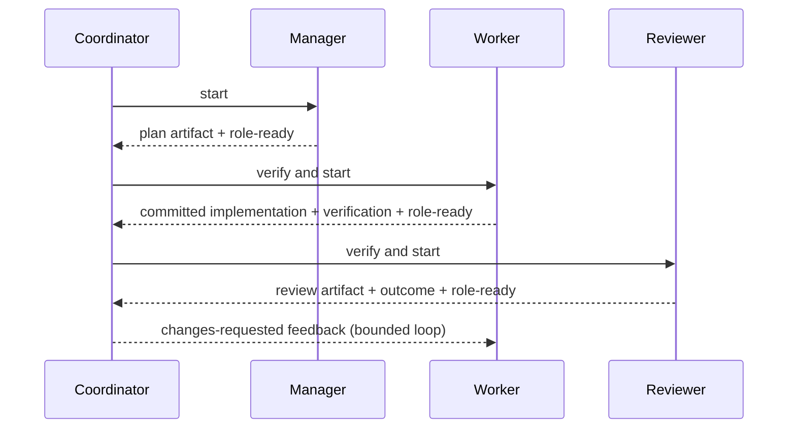

[English](../../README.md) | [日本語](README.md)


# Flybridge

Flybridge は、[Orca](https://www.onorca.dev/) 上で単体エージェントおよびオーケストレーションを扱う制御プレーンです。GitHub Project board とも連携し、issue-based 開発を支援します。

- [仕様書](specification.md)
- [アーキテクチャ](architecture.md)
- [ADR](decisions/)
- [skill・command catalog](skill-and-command-catalog.md)

## 全体の流れ

Flybridge 自身も LLM で操作されることを想定しています。Flybridge レポジトリルートまたはそれを含むディレクトリで エージェントを起動し、対話しながらタスクを遂行してください。

1. GitHub Project board から issue 情報を取得する。
2. ローカルの作業状況と照合して、状態を確認する。
3. ユーザーが1件以上の issue を選択する。
4. それらに対し、各ワークツリー上で作業を実施する。



この流れを選択した issue ごとに繰り返すため、複数の issue を別々の worktree で開始または継続できます。候補抽出は読み取り専用で、issue の選択や自動 dispatch は行いません。

以下は、Flybridge が orchestrated workflow を起動した後の Orca workspace のスクリーンショットです。


<!-- IBus は主に日本語・中国語・韓国語などのユーザー向けなので、それ以外の言語向けの README では不要。-->

> [!WARNING]
>
> IBus を使用する Linux desktop session では、複数の Flybridge workflow や Orca agent terminal を同時に実行すると IBus の resource 使用量が増加し、キー入力や desktop 全体が重くなる場合があります。発生した場合は `ibus restart` を実行してください。

## 要件とセットアップ

- Linux または macOS。
- 対応する version の CLI を備えた稼働中の [Orca](https://www.onorca.dev/)。workflow 開始前に `doctor` が runtime へ到達できることを確認します。
- Python 3.11以上と [uv](https://docs.astral.sh/uv/)。CI は Python 3.11、3.12、3.13 を検証し、最低バージョンの正本は `requires-python` metadata です。
- Git は workflow repository に必要です。`gh` は任意の GitHub Project 連携を有効にしたときだけ必要です。

Flybridge は source checkout としての利用をサポートします。単一の配布packageは公開しておらず、`pip install flybridge` はサポート対象外です。

```bash
uv sync --all-packages
cp config/flybridge.ja.jsonc.example config/flybridge.jsonc
uv run --package flybridge-cli flybridge doctor
```

## 個人設定

ユーザー設定は既定で `config/flybridge.jsonc` です。同フォルダ内のサンプルファイルをコピーしてからカスタムしてください。カスタムを LLM に依頼してもよいでしょう。別の設定ファイルを使う場合は `--config` を指定します。

| key                               | description                                                                                                                                   | value                                          |
| :-------------------------------- | :-------------------------------------------------------------------------------------------------------------------------------------------- | :--------------------------------------------- |
| `default_mode`                    | 1つの agent role を起動するか、Flybridge の固定オーケストレーターを起動するか。                                                               | `single`, `orchestrated`                       |
| `state_dir`                       | SQLite state と content-addressed plan / verification / review artifact を置く private directory。                                            | 任意のパス                                     |
| `orca.executable`                 | 呼び出す Orca CLI コマンド。                                                                                                                  | `orca-ide` または実行ファイルへのパス          |
| `orca.agents`                     | 各 role のエージェントと任意の model。`reviewer` は配列にでき、coordinator は全報告を待つ。                                                   | TUI ID、`{agent, model}`、または reviewer 配列 |
| `orca.launch_presets`             | package 同梱の agent 起動 preset を置換する、任意の追跡対象 JSON file。                                                                       | 絶対 path または config 相対 path              |
| `orca.launch_overrides`           | 選択した local preset を置換する、任意の追跡対象外 JSON file。存在しない場合は無視する。                                                      | 絶対 path または config 相対 path              |
| `reconcile`                       | workflow command 前の自動同期、欠落 worktree の回数/猶予、event 保持件数、除外する worktree 名または glob。                                   | 任意。既定は `true`、`2`、`300`、`10000`、`[]` |
| `skills.sources`                  | 全 role で共有する skill のパス。                                                                                                             | 文書・catalog directory・glob の配列           |
| `skills.roles`                    | role ごとに追加する skill のパス。                                                                                                            | 各 role のパス配列を持つ object                |
| `skills.operator`                 | 親 operator が読む非公開案内。Flybridge workflow role は増やさない。                                                                          | 文書・catalog directory・glob の配列           |
| `skills.response_language`        | エージェントが応答する言語。                                                                                                                  | 言語名（例: `Japanese`）                       |
| `queue.observer`                  | root workflow で queue 監視ターミナルを開くか。agent terminal の置換後も有効なら復元する。                                                    | `true`, `false`                                |
| `queue.resources`                 | role prompt へ注入する排他資源の名前。                                                                                                        | 文字列の配列                                   |
| `orchestration.max_review_cycles` | autonomous worker/reviewer cycle が blocked になるまでの最大回数。                                                                            | 正の整数                                       |
| `github.enabled`                  | GitHub Project 連携を使うか。                                                                                                                 | `true`, `false`                                |
| `github.login`                    | 自分の GitHub ユーザー名。Flybridge の GitHub コマンドが使う `gh` アカウント、`board screen` の既定の担当者、`prs screen` の既定 `--author`。 | ログイン名                                     |
| `github.boards`                   | 読む Project の一覧（owner、番号、Status / Priority の field 名）。                                                                           | object の配列                                  |

skill のパスには文書・catalog directory・glob を指定できます。directory は配下の `SKILL.md` をソート順に展開し、`~` と directory のシンボリックリンクは解決するため、マシンごとに実体が違う `~/projects/...` を共有できます。内容は対象リポジトリへコピーしません。

worktree をまたぐ運用作業の前に `flybridge operator guide` を実行し、設定済み Operator 文書の index を取得します。この command は path と応答言語だけを出力し、非公開文書の内容を出力しません。Operator は workflow を開始・進行する呼び出し側であり、5つ目の Flybridge workflow role ではありません。

## LLM への依頼

Flybridge repository、またはその親ディレクトリで LLM を実行し、目的を自然言語で依頼してください。[AGENTS.md](../../AGENTS.md) は Codex、Claude、Cursor 向けの簡潔な入口で、詳細な利用者向け・技術文書へのリンクをまとめています。LLM はまず必要に応じて `doctor` を実行し、設定と [Orca](https://www.onorca.dev/) runtime を確認してから、適切な Flybridge またはプロジェクトのコマンドを選びます。通常の実装では、依頼に対象repositoryと mode を明記します。

小さく独立した変更には `single` を、計画・実装・review を分ける価値がある変更には `orchestrated` を選んでください。manager は plan を commit せず、worker が review 前に実装を commit します。

以下をコピーして `<...>` を埋めれば、実装依頼を一貫して伝えられます。

```text
`<対象 repository>` で `<single または orchestrated>` モードを使い、`<issue または作業内容>`を実装してください。
完了条件: `<期待する動作・変更>`
確認方法: `<test、lint、headed 実行など>`
```

| 依頼例                                                                                            | 実行・対応                                                                                                                                                                                                                                 |
| ------------------------------------------------------------------------------------------------- | ------------------------------------------------------------------------------------------------------------------------------------------------------------------------------------------------------------------------------------------ |
| 「私がアサインされている issue を一覧してください。」                                             | `flybridge board screen` を実行します（`--assignee` 省略時は `github.login`）。読み取り専用です。件数が多いときは `--status` / `--priority` / `--board` のどれで絞るかをユーザーに質問し、結果を切り捨てません。                           |
| 「私が提出した PR を一覧してください。」                                                          | `flybridge prs screen` を実行します（`--author` 省略時は `github.login`）。読み取り専用です。review 本文が必要なら `--with-review-facts` を付けます。worktree の有無では絞りません。                                                       |
| 「優先度 High の Todo を、担当者に関係なく一覧してください。」                                    | `flybridge board screen --all-assignees --status Todo --priority High` を実行します。                                                                                                                                                      |
| 「私がアサインされているのに、ローカルにワークツリーもブランチもない issue を一覧してください。」 | `flybridge board screen --with-refs` を実行し、呼び出し側が空の `worktrees` と `development` から判断します。接合キーは Orca comment 内の GitHub issue URL（または同一 repo の linked issue）であり、ディレクトリ名ではありません。        |
| 「`<issue または作業内容>`をシングルモードで実装してください。」                                  | `doctor --mode single` の後、`workflow start --mode single --issue <canonical GitHub issue URL>` で単体エージェント workflow を開始します。                                                                                                |
| 「`<issue または作業内容>`をオーケストレーターモードで実装してください。」                        | `doctor --mode orchestrated` の後、`workflow start --mode orchestrated --issue <canonical GitHub issue URL>` を実行します。永続 coordinator が operator の proceed なしで role を進めます。                                                |
| 「進捗を確認してください。」                                                                      | `workflow status <workflow-id>` で `progress`、run、review cycle、role state、repository identity、artifact、coordinator outcome を確認し、必要に応じて `queue status` も使います。生きている manager タブへの質問も同じ JSON を読みます。 |
| 「中断した作業を再開してください。」                                                              | 保存済み worktree を使う `workflow resume <workflow-id>` を実行します。失敗済み workflow なら、状態を確認して `workflow cleanup` と `workflow retry` を使います。                                                                          |
| 「この既存 worktree で作業を再開してください。」                                                  | `workflow start <worktree-path> --attach-existing` を使います。同じ checkout に新しいエージェントを起動します。Flybridge 管理済みなら workflow ID を維持し、未管理なら checkout を削除しない新規 root workflow として接続します。          |
| 「成果を目視で確認したいので、headed で実行してください。」                                       | LLM が対象プロジェクトの test / browser 手段を確認し、利用可能な headed 実行を選びます。Flybridge 自体には `headed` サブコマンドはありません。                                                                                             |
| 「queue の待ち状況を見せてください。」                                                            | `queue status`、継続表示が必要なら `queue watch` を実行します。worktree の observer は FIFO 昇格後に lease-id をエージェントへ送ります。                                                                                                   |

## オーケストレーターモードについて

オーケストレーターモードを起動すると、Flybridge の操作を行う Coordinator の指示の下、ワークツリー上で `Manager → Worker → Reviewer` が作業を行います。マネージャーへの作業依頼が完了したら Coordinator は解放されるので、他ワークツリーへの指示を依頼することもできます。

Manager は方針判断や作業計画に集中し、実装を Worker に、コードレビューや Issue スコープとの照合を Reviewer に任せます。これにより、スレッドを短く保ち、コンテキスト汚染を抑制します。

エージェントの役割を Manager, Worker, Reviewer と分けているので、それぞれに最適なエージェントは異なるはずです。そこで、使用するモデルや与えるスキルを別々に設定する設計になっています。



## 開発

```bash
uv sync --all-packages
uv run pre-commit install
uv run pre-commit run --all-files
uv run python scripts/test.py -q
```

brand PNG の生成には ImageMagick が必要です。正方形ロゴと README header は `uv run python scripts/generate_brand_images.py` で正本の SVG から再生成できます。別のサイズを生成する場合は `--output`、`--width`、`--height` を同時に指定します。

MIT license はルートの `LICENSE` です。package metadata は SPDX 識別子だけを持ち、独立した wheel としては公開しません。

CI は secret scan、同じ pre-commit hook と test、および全 package の build を実行します。hook は PNG、GIF、JPEG、WebP 画像から metadata を削除し、公開 source の privacy audit、日本語の文字幅に対応した Markdown table 整形、行幅折り返しなしの markdownlint、Ruff、ファイル衛生も対象にします。画像の metadata が削除された場合は、変更された画像を stage して pre-commit を再実行します。ローカルで hook を回す前に `.private-audit.yaml.example` を gitignore 対象の `.private-audit.yaml` へコピーします。pull request には private deny list を渡さないため、privacy audit は skip します。

## セキュリティ

脆弱性を public issue に報告しないでください。対応バージョンと非公開の報告方法は [セキュリティポリシー](security.md) に記載しています。
