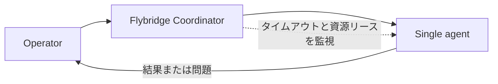
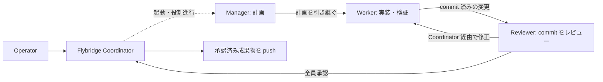
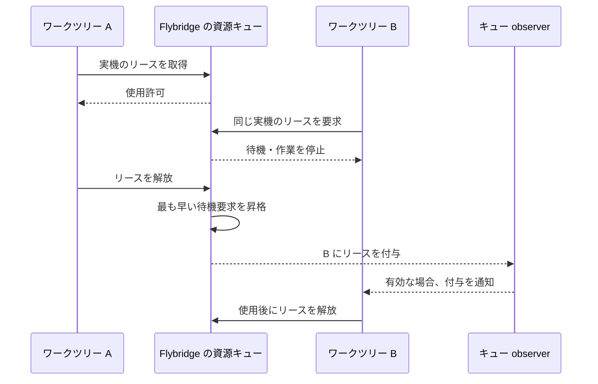

[English](../../README.md) | [日本語](README.md)


# Flybridge

Flybridge は、[Orca](https://www.onorca.dev/) 上でソフトウェア開発のワークフローを開始・追跡するツールです。Orca はワークツリー、エージェントのターミナル、作業を見渡す画面を提供します。Flybridge はワークフローの状態、単体エージェントまたは役割を分けたチームによる実行、同時実行できない作業のためのキューを管理します。任意の GitHub Project 連携は作業候補の発見に使い、issue の選択や作業開始は自動化しません。

ソースチェックアウトから CLI を実行するか、このリポジトリで動く LLM にコマンドの実行を依頼して使います。

## 要件とセットアップ

<!-- IBus は日本語入力環境に関係するため、この注意書きは日本語版 README にのみ掲載する。 -->

> [!WARNING]
>
> IBus を使用する Linux デスクトップでは、複数の Flybridge ワークフローや Orca エージェントターミナルを同時に実行すると、IBus のリソース使用量が増え、キー入力やデスクトップ全体が重くなる場合があります。発生した場合は `ibus restart` を実行してください。

- Linux または macOS。
- 対応するバージョンの CLI を備えた、稼働中の [Orca](https://www.onorca.dev/)。`doctor` で runtime へ到達できることを確認します。
- Python 3.11 以降、[uv](https://docs.astral.sh/uv/)、Git。
- `gh` CLI は任意の GitHub 連携を有効にする場合だけ必要です。

Flybridge レポジトリまたはその親ディレクトリで起動した LLM に、セットアップと設定の調整を依頼できます。セットアップ後は、対象リポジトリまたは既存ワークツリー、目的、モード、完了条件、必要な確認を伝えてください。

Flybridge はソースチェックアウトとして利用します。`pip install flybridge` による配布はしていません。

```bash
uv sync --all-packages
cp config/flybridge.ja.jsonc.example config/flybridge.jsonc
uv run --package flybridge-cli flybridge doctor
```

## 作業の管理

Flybridge は自身のワークフロー記録および Orca ワークツリーとして、作業を管理します。複数のタスクを独立に開始・再開でき、Orca の画面から状態を確認できます。Flybridge はワークツリーの正確な ID を記録するため、再開時は既存の作業場所に戻ります。

ワークフローには二つのモードがあります。

| モード         | 動作                                                                                                                                                                | 向いている作業                 |
| :------------- | :------------------------------------------------------------------------------------------------------------------------------------------------------------------ | :----------------------------- |
| `single`       | 一つのエージェントが実装と確認を行う。Operator が報告を検証してワークフローを完了させる。                                                                           | 小さく独立した変更。           |
| `orchestrated` | Manager が計画し、Worker が実装・確認し、1人以上の Reviewer が commit 済みの成果を確認する。永続的な Coordinator が役割を進め、設定した回数内で修正依頼に対応する。 | 計画とレビューを分けたい作業。 |

single モードでは、Flybridge Coordinator が Orca のワークツリー上で一つのエージェントを起動し、タイムアウトと資源リースを監視します。エージェントは実装、必要な確認、セルフレビューを行い、ローカル検証に通ったら commit・push して結果または問題を報告します。Operator が報告を確認してワークフローを完了させます。



orchestrated モードでは、同じ Flybridge Coordinator が三つの AI 役割を順に進めます。Manager はリポジトリを変更せず計画を記録します。Worker は実装と必要な確認を行い、commit と検証結果を記録します。Reviewer はその commit を確認します。修正依頼があれば設定された上限内で Worker に戻り、全 Reviewer が同じ commit を承認したら、Coordinator が変更を取り込み、配送前の確認を行って push します。役割ごとにエージェント、モデル、外部スキルを設定できます。



orchestrated モードを利用すると、以下のように、階層化されて複数のエージェントが起動し、作業を分担します。この例では LLM モデルの異なる3つの Reviewer を使用して、ロバスト性を高めています。タイトルの prefix は AI の役割を表し、`[M]` = Manager、`[W]` = Worker、`[R]` = Reviewer です。single モードの場合は `[S]` と表示されます。LLM 自身がタイトルを更新した場合は、それが優先されます。


## 競合する資源の共有

ワークツリーを並走させても、実機、テスト設備、大きなビルドなど、同時には使えないものがあります。`queue.resources` に資源名を設定すると、エージェントは競合する作業の前にリースを取得し、終了後に解放します。Flybridge は資源ごとに先着順でリースを付与します。待機中のエージェントは作業を止め、キューの observer が有効なら付与通知を受けて再開できます。その間も別ワークツリーの作業は進められます。高負荷な動作確認は利用例の一つであり、専用のキュー種別ではありません。



`queue status` で現在の状態を、`queue watch` でイベントを確認できます。キューはワークフローの所有情報を保持し、CLI プロセスが終了しても状態が残ります。ライフサイクルと復旧方法は [資源キューの仕様](specification.md)を参照してください。

## 任意の GitHub Project 連携

`github.enabled` と board を設定すると、`board screen` で issue 候補を一覧化できます。`--with-refs` を付けると関連するローカルワークツリーと開発参照情報が加わります。`prs screen` は自分が作成した pull request を一覧化します。これらのコマンドは読み取り専用です。issue を選ぶのはユーザーで、その後にワークフローを開始または再開します。ディレクトリ名から issue は判定しません。

```bash
uv run --package flybridge-cli flybridge board screen --with-refs
uv run --package flybridge-cli flybridge prs screen
```

既存の作業場所には `workflow start --attach-existing` を使います。複数の既存ワークツリーには `workflow start --batch <file.json>` を使い、順に起動して各結果を確認できます。入力形式や復旧コマンドは[仕様書](specification.md)を参照してください。

## 設定と資料

ユーザー設定の既定値は `config/flybridge.jsonc` です。別の JSONC ファイルは `--config` で指定できます。編集前にサンプルをコピーしてください。主な設定項目は次のとおりです。

| キー                                              | 用途                                                                |
| :------------------------------------------------ | :------------------------------------------------------------------ |
| `default_mode`                                    | `single` または `orchestrated` の既定値。                           |
| `orca.agents`                                     | 役割ごとのエージェントと任意のモデル。`reviewer` は配列も指定可能。 |
| `skills.sources`、`skills.roles`                  | 共通および役割別の外部スキルのパス。                                |
| `skills.operator`                                 | 親 Operator 用のガイド索引。ワークフローの役割とは別。              |
| `skills.response_language`                        | エージェントの応答言語。                                            |
| `queue.resources`、`queue.observer`               | 排他資源名と可視キュー observer の設定。                            |
| `orchestration.max_review_cycles`                 | Worker と Reviewer の自動修正サイクルの上限。                       |
| `github.enabled`、`github.login`、`github.boards` | 任意の GitHub 連携。                                                |
| `state_dir`、`reconcile`                          | 永続状態の保存先と Orca との照合設定。                              |

スキルのパスには文書、カタログディレクトリ、glob を指定できます。Flybridge はワークフロー開始時に解決し、該当する役割へ索引を渡します。内容を対象リポジトリにはコピーしません。ワークツリーをまたぐ運用の前には `flybridge operator guide` で Operator 文書の索引を確認できます。

- [仕様書](specification.md): コマンド、状態、運用上の規則。
- [アーキテクチャ](architecture.md)と[設計判断](decisions/): 実装の境界と理由。
- [スキル・コマンド一覧](skill-and-command-catalog.md): 同梱のコマンドとスキル。

## 開発

```bash
uv sync --all-packages
uv run pre-commit install
uv run pre-commit run --all-files
uv run python scripts/test.py -q
```

CI は secret scan、pre-commit、テスト、package build を実行します。ローカルで pre-commit を実行する前に `.private-audit.yaml.example` を gitignore 対象の `.private-audit.yaml` にコピーしてください。ブランド画像は ImageMagick と `uv run python scripts/generate_brand_images.py` で正本の SVG から生成します。ルートの [LICENSE](../../LICENSE) は MIT です。
