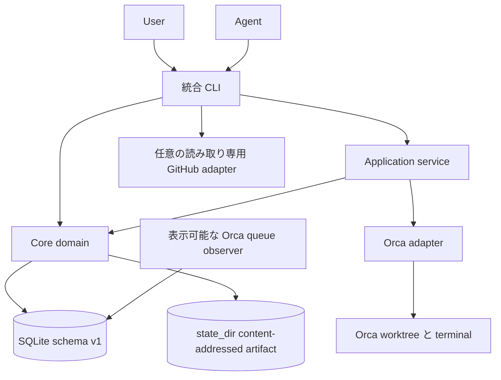
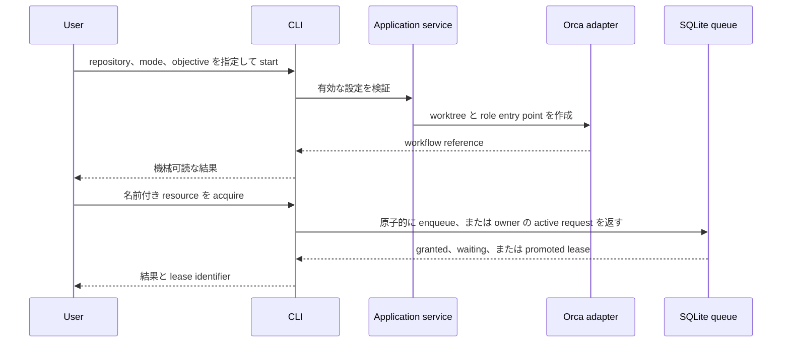
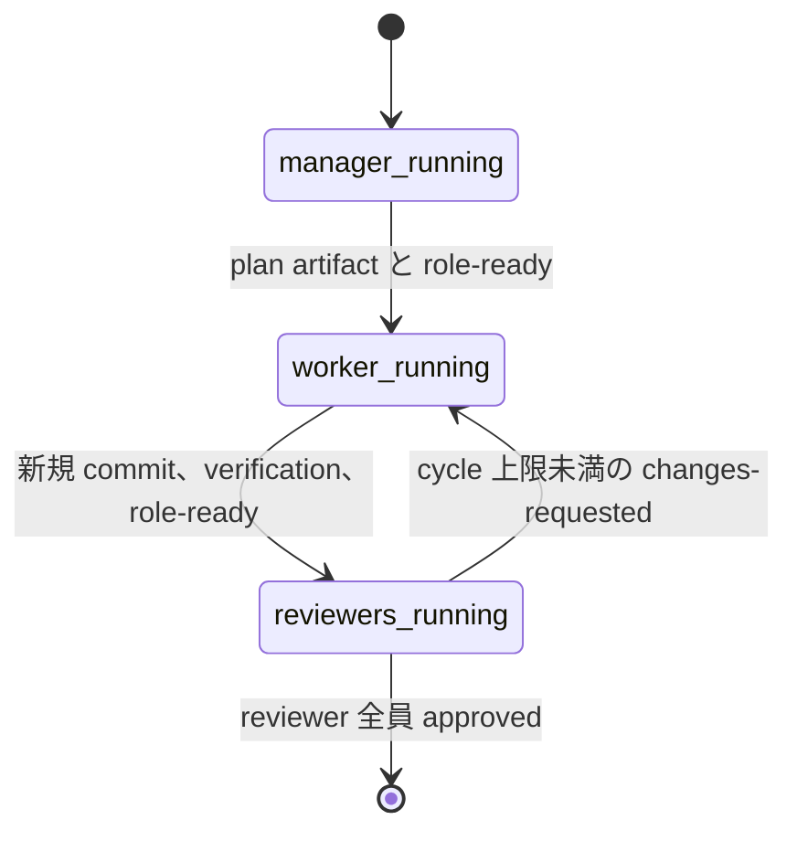

# アーキテクチャ

[English](../en/architecture.md) | [日本語](architecture.md)

この文書は v1.0.0 の state と orchestration の境界を定めます。規範となるユーザーから見える動作は[仕様書](specification.md)、設計上の選択は [ADR](decisions/) に記載します。

## レイヤーと依存関係

| レイヤー            | 担当するもの                                                                                            | 担当してはならないもの                                       |
| ------------------- | ------------------------------------------------------------------------------------------------------- | ------------------------------------------------------------ |
| `core`              | 設定の検証、workflow と resource lease の状態、決定論的な遷移                                           | Orca または GitHub のコマンド構文、subprocess、prompt policy |
| application service | use case の調整、role 起動順序、入力検証、adapter interface                                             | 永続的な状態形式または vendor 固有のコマンド                 |
| `orca`              | Orca CLI の呼び出し、worktree と terminal の lifecycle                                                  | queue policy または GitHub query                             |
| `github`            | 任意の Project 一覧、提出 pull request 一覧、および inventory の pull-request 情報                      | 選択 policy、自動 dispatch、ローカル worktree の照合         |
| `cli`               | コマンド解析、出力、終了 status、resource queue 制御、読み取り専用 GitHub screening、worktree inventory | `core` の business rule の重複実装                           |

依存関係は内側を向きます。workflow の entry point は application service を使い、単純な state 指向の CLI 操作は core を直接呼び出すことがあります。Core は adapter を import しません。将来の IDE adapter は `orca` と同じ application 向け interface に従います。範囲を限定した `board screen` query に application policy はありません。CLI flag が board と GitHub field の値を選び、GitHub adapter は Project item の page 処理だけを行います。ローカル worktree の照合は workflow start の外にあり、`flybridge inventory` だけが Orca path を git および pull-request 情報と結合します。`flybridge prs screen` は worktree 照合なしで提出 pull request を列挙します。GitHub adapter は設定の `github.login` token を使います。

## 制御フロー

## Runtime の所有権

Flybridge は daemon を作りません。agent と operator は SQLite ベースの queue state に対して同じ CLI を共有します。queue observer は明示的に作成される Orca terminal で、FIFO 昇格後に lease grant prompt を送信できますが、queue の順序を変更しません。永続的な state は SQLite に置かれるため、terminal を閉じても残ります。`workflow cleanup` は Flybridge が所有する stale record と、child worktree が残った終了 root を報告します。残った child は age `--apply` ではなく retire します。無関係な process を kill してはなりません。adapter subprocess は実行時間を制限し、caller の終了前に完了を待ちます。

統合された `flybridge.sqlite3` state database には SQLite WAL mode が必要です。WAL を有効にできない filesystem は rollback journal を暗黙に使わず拒否します。schema version 1 は run、step、dependency、agent run snapshot、worktree、repository checkout、external reference、operation、FIFO request を関連付けます。旧 `workflows.sqlite3` と `queue.sqlite3` は自動変換も削除もしません。

reconcile daemon はありません。workflow command 前に軽量な Orca 全件 scan を行い、list/status は失敗時に保存済み state と freshness/error を返し、変更 command は fail closed します。明示的な `flybridge reconcile` は git checkout も観測します。欠落の証拠になるのは成功かつ非 truncate の scan だけで、既定では300秒以上離れた2回の欠落で管理中 step を cancel します。

実行中の record は Flybridge process の終了後も、正確な Orca worktree ID、path、現在の agent terminal handle、独立した observer handle を保持します。明示的な resume はその worktree を検証し、生きている agent handle を再利用するか、既存 worktree 内に1つだけ代替 terminal を作成します。core は adapter が resume prompt を送る前に agent ownership を原子的に交換します。resume 経路で worktree は作成しません。

orchestrated record は3つの独立した identity を永続化します。`implementation_repository` は GitHub `nameWithOwner`、`runtime_repository_id` は完全な Orca worktree ID から得て child 作成時の repository を選ぶ値、`start_sha` は manager の pristine state、worker commit、ancestry 検証の基点です。この分離は `--attach-existing` root と全 child で維持します。

## 決定論的な role 実行

manager、worker、reviewer は別々の永続 record です。親 role の選択、handoff、role 順序、review-cycle limit、readiness consumption は application policy であり、prompt の解釈ではありません。1つの coordinator terminal が restart-safe supervisor loop を実行します。role が role-owned artifact を保存して `role-ready` を記録すると、supervisor は artifact digest、repository identity、Git state を検証してから role を完了し child を起動します。successor の running を確認した後に readiness を consume するため、transition は replay-safe です。

artifact は `state_dir/artifacts/workflows/<manager-id>/` 配下の private かつ size-bounded な UTF-8 file です。file 名には content の SHA-256 を含み、SQLite v4 は digest、size、owner、relative path を保持します。manager は `start_sha` のままとし、reviewer worktree に渡るのは worker の実装 commit だけです。changes-requested review は既存 worker に注入され、review 済み SHA より新しい commit を要求します。

coordinator は daemon ではなく durable ownership です。terminal run の完了・失敗・blocked を記録し、自身の handle を active ownership から解放し、結果を出力して flush してから terminal を self-close します。self-close が失敗した場合は operator cleanup が inactive tab を閉じられます。手動の `proceed`、`handoff`、`advance` は復旧・診断専用です。

## 拡張ポイント

- 現在の release に含まれる adapter は Orca のみです。
- GitHub integration は任意です。`board screen` は Project issue を列挙するだけで、issue から workflow を開始するかどうかは人間が選びます。`--with-refs` は application layer で、正規 issue URL の集合と development ref により issue をローカル worktree および GitHub development 情報と結合します。`prs screen` は worktree 照合なしで提出 pull request を列挙します。`inventory` は作業を dispatch せず、親と submodule の repository ごとに open / merged / closed / hinted の pull-request 情報を query できます。filter 値は CLI flag です。
- 外部 skill はこの repository の外に残ります。設定でその path と role assignment を指定し、prompt にはそれらの path の英語索引を渡します。
- single-agent と orchestrated workflow は同じ `start` use case を使います。role plan は異なりますが、どちらも設定や state rule を迂回しません。
