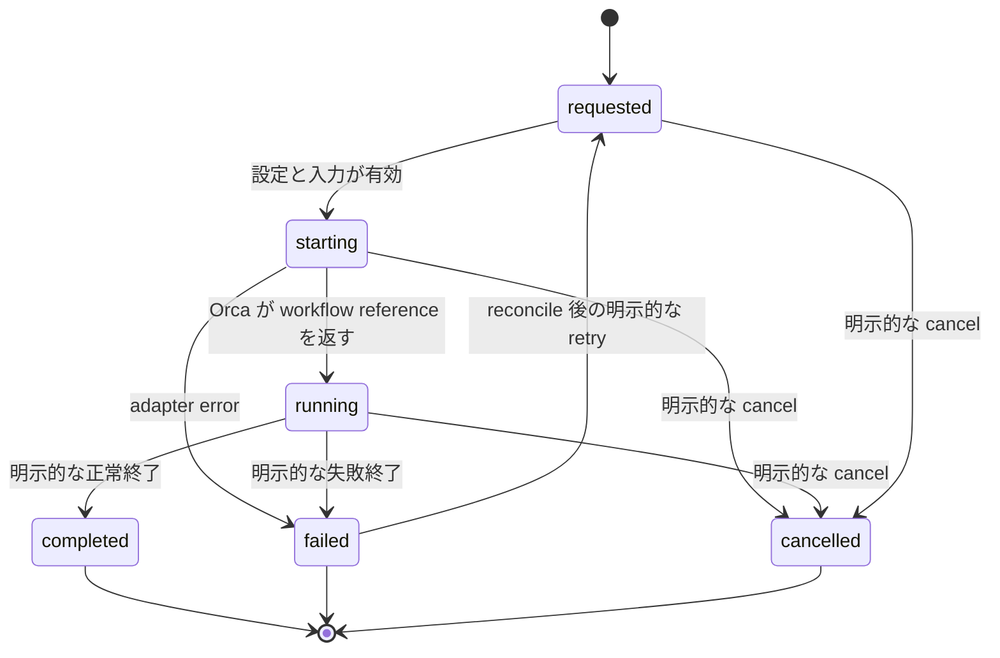
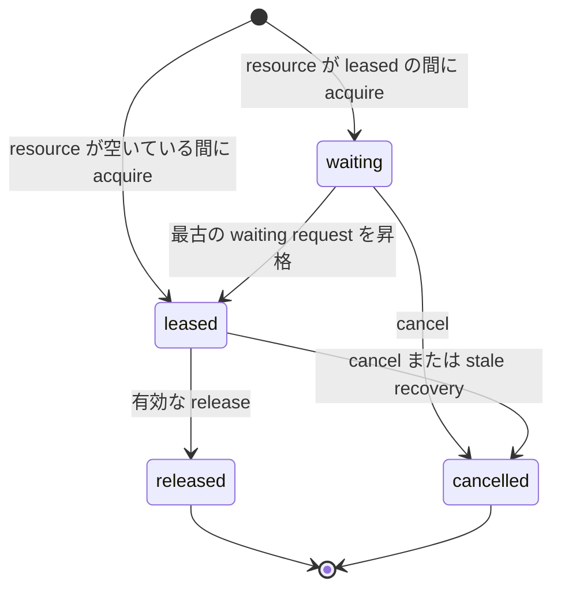

# Flybridge v1.0.0 仕様書

[English](../en/specification.md) | [日本語](specification.md)

## 目的と範囲

Flybridge は Orca native のソフトウェア開発 workflow を開始・監視します。single-agent mode と role 分離 mode、GitHub Project からの任意の手動選択、読み取り専用の Orca worktree inventory、外部 skill index、および決定論的な排他的 resource coordination をサポートします。

バージョン 1.0.0 は、別の IDE、board 駆動操作の必須化、自動優先順位付け、自律的な issue 選択、環境からの設定、非公開 skill の内容の repository へのコピーをサポートしません。

## 設定の契約

- 有効なユーザー設定は `--config` で渡す1つの JSONC ファイルで、既定値は `config/flybridge.jsonc` です。
- `default_mode` を上書きするのは `workflow start --mode` と `doctor --mode` だけ、`queue.observer` を上書きするのは `workflow start --queue-observer` / `workflow start --no-queue-observer` だけです。ほかの command line 引数は JSONC field の上書きではなく操作への入力です。環境変数と XDG 設定 location は設定入力ではありません。
- 英語と日本語の設定例を commit します。ユーザーの設定とその絶対 skill path は Git から除外します。
- runtime state は設定された state directory を使います。既定値は XDG state location ですが、この location がユーザー設定を供給することはありません。SQLite state と配下の content-addressed workflow artifact には private permission を使います。
- skill path には文書、catalog directory、glob pattern を指定できます。`~` を展開し、ディレクトリの symbolic link を解決します。catalog directory は再帰的に、sort 済みの `SKILL.md` 文書へ展開されます。glob の一致先と解決後の文書は Orca workflow の開始前に存在しなければなりません。設定した root の外へ解決される catalog entry は拒否します。
- `skills.sources` と role 固有 path は絶対パスです。この順に結合し、重複 path を除きます。`skills.operator` は親 operator 用の別の絶対 path 配列で、role prompt と workflow record には影響しません。
- `operator guide` は設定済み Operator 文書の index と応答言語だけを検証・出力し、非公開文書の内容を出力しません。短い instruction により、Operator は workflow 全体の制約を一度だけ判断し、その結論と有効範囲を role に渡し、issue または review の事実には原典 URL を渡し、必要な検証の証拠（コード検査以外の証拠提出や、求められた hosted CI のキックを含む）が揃うまで lifecycle を完了しません。hosted CI は起動までが完了条件で、結果待ちはしません。失敗した hosted check は log から分類し、許可された一時的な service または infrastructure failure は不要な code work を割り当てずに再実行します。

## Workflow の契約

- start request は repository、mode、name、英語の objective を持ちます。
- `single` は1つの agent role を開始します。`orchestrated` は `manager`、`worker`、`reviewer` の固定された永続 plan を作成し、順序は LLM ではなく Flybridge が決めます。
- manager prompt が許可するのは planning だけです。implementation、repository 変更、agent 作成、delegation、入れ子の orchestration、手動 lifecycle command を禁止します。plan は commit ではなく `state_dir` artifact です。
- 各 orchestrated role は role 所有の `plan`、`verification`、`review` artifact を保存して `workflow role-ready` を呼びます。readiness は冪等で role terminal を閉じず、検証済み artifact digest と content を snapshot します。永続 coordinator が source を完了して予定された successor を起動します。
- single role は workflow artifact を保存せず、`role-ready` も呼びません。結果または blocker を報告して停止し、operator が検証して workflow を終了します。
- role prompt は判断と原典の事実を分離します。role は Operator が示した workflow 全体の判断を、その対象と有効期間内では再判断せずに従います。一方、scope または変更要求を判断する前に、提示された issue、pull request、review comment の URL を自分で読みます。successor handoff では、原典を要約で置き換えず、結論、対象、有効期間、原典 URL を渡します。
- reviewer の start / resume prompt は、その run の `workflow_refs` を問い合わせます。明示登録された `primary` / `related` issue / pull request URL だけを列挙し、推論 candidate は screening data のままにします。review 前にすべての issue body / discussion と PR description / discussion / review / inline comment を reviewer 自身が直接読むよう要求します。objective text や artifact から別の review source を追加しません。
- manager は acceptance criteria、必要な検証、前提条件を定めます。criteria はコード差分に限らず、求められた証拠提出と hosted CI のキックを含みます。hosted CI は起動までが完了条件で、結果待ちはしません。worker はすべての criteria の証拠を集め、reviewer は証拠を criteria に対応付け、single role は implementation と self-review の両方を行います。worker と single role は repository の contributor guidance と CI configuration を確認し、CI が all-files check を行う場合はそれも含め、最終 tree でローカル再現可能な必須 check をすべて実行します。必要な data、access、environment がない場合、狭い検証で代替してはなりません。orchestrated role は必須 artifact に verified/unverified scope を記録して blocked readiness を宣言し、single role は完了を主張せず operator に blocker を報告します。
- orchestrated start は manager、要求済み child record、orchestration run を永続化し、coordinator terminal を1つ作ります。coordinator は durable readiness を監視し、artifact と Git state を検証し、handoff 記録、source complete、次の eligible child の launch を行います。replay 時に successor が running と確認できた後で readiness を consume します。
- reviewer 全員の `approved` readiness で run を完了します。1件でも `changes-requested` ならそれらの reviewer worktree を削除し、すべての review artifact を既存 worker に注入して、新しい worker commit 後に review を繰り返します。正の `orchestration.max_review_cycles` が循環を制限し、上限到達時は durable error とともに blocked になります。
- manager、worker、reviewer は、必須 artifact に verified/unverified scope を記録した後、`role-ready --outcome blocked` を使えます。repository gate は引き続き適用します。coordinator は blocked role を閉じ、requested successor を cancel し、blocker の consume と run の blocked 化を同一 transaction で行います。status は reviewer の approved/changes-requested outcome と分離した structured blocker を公開します。
- 一時的な coordinator failure は error count と retry timestamp を run に永続化します。`orchestration.max_coordinator_errors`、`retry_initial_seconds`、`retry_max_seconds` が supervisor restart をまたぐ exponential backoff を制限します。
- `workflow coordinator-retry ROOT_ID` は operator 専用の hot-upgrade/crash recovery control です。live な stale coordinator を閉じ、eligible な blocked/failed run metadata を CAS reset し、role/readiness record を変更せず現行 code の coordinator を開始します。completed run、consume 済み declared blocker、consume 済み review cycle 上限 outcome は terminal のままです。同じ run の未 consume blocker は明示的に replay できます。
- manager は記録済み `start_sha` のままでなければなりません。reviewer worktree は worker branch から作るため、review に届くのは commit 済み implementation だけです。worker readiness は HEAD が未変更の場合や uncommitted change がある場合に拒否します。
- child の起動前に、必須の1行 handoff summary を英語 prompt に含めます。handoff がない、または一致しない場合は Orca create 操作を行いません。その handoff を記録せずに predecessor を完了することも拒否します。
- コマンドは workflow reference を含む構造化出力を返します。preflight に失敗した場合は、不完全なローカル workflow record を残さず non-zero で失敗します。
- Orca reference は単なるローカル path ではなく、Orca が返した完全な worktree ID です。workflow identity は GitHub implementation repository、この reference から得る Orca runtime repository ID、開始時 Git SHA を別々に保持します。child 作成では runtime ID を選び、readiness、resume、review-cycle transition ではすべての identity を検証します。
- Flybridge は Orca lifecycle metadata の更新前に、完全な Orca worktree ID、path、startup terminal handle を永続的に記録します。更新に失敗した場合は、正確に所有している worktree terminal を閉じ、failed record を保持します。
- `workflow resume <workflow-id>` が受け付けるのは永続化された `running` record だけです。記録された完全な worktree ID を exact ID selector で検証し、worktree を作成しません。有効な agent terminal は再利用します。stale または欠落した handle は、時間制限付きの TUI idle 確認後、既存 worktree 内で一度だけ置き換えます。置換は別に所有される observer terminal に影響を与えず、stale な agent ownership を原子的に置き換えます。`queue.observer` が true なら resume は永続化された observer policy を有効にして queue observer を付け直します。`--no-queue-observer` は `workflow start` の上書き専用です。
- 同じ解決済み repository と objective に `requested`、`starting`、`running` の root がすでにある場合、明示的な `--allow-duplicate` がなければ root start を拒否します。同じ repository 内の異なる objective は独立します。
- 既定の workflow 名は sub-second time と random suffix を組み合わせ、同時生成される名前が秒単位の clock 精度に依存しないようにします。active workflow 名（`requested`、`starting`、`running`）は一意です。cancelled、failed、completed の名前は external ownership の reconcile 後に再利用できます。未 reconcile の以前の owner がある場合、launch は新しい external agent を割り当てる前に cleanup command を示して拒否します。
- `-o @path` と `--objective-file PATH` は UTF-8 file から objective を読みます。prompt に渡すのは path string ではなく file の内容です。`workflow start --batch` も各 item の `objective_file` に同じ helper を使います。run には解決済み絶対 path と SHA-256 も保存し、直接指定では source path を保存しません。
- `workflow list [--status ...] [--json]` は `id`、`name`、`status`、`role`、`mode`、`repository`、`worktree_path`、`adapter_reference`、`updated_at`、`owns_worktree`、`queue_observer_enabled`、`owner_terminal_valid`、`observer_stop_reason` を含む workflow row を出力します。`workflow observe` は生きている owner agent terminal が必要で、そうでなければ終了 status 2 で `workflow resume` を先に実行するよう伝えます。observe が成功すると `queue_observer_enabled` を永続化します。
- 互換 `id` は step ID のまま維持し、出力へ `run_id` を追加します。status は run root と step ID のどちらも受け付けます。

### Reconcile と関連 state

- `flybridge reconcile [--dry-run] [--no-github]` は transaction 外で Orca 全worktreeを観測し、完了した scan を一括適用します。外部作成worktreeは `unmanaged` となり、明示 attach まで所有権を得ません。`reconcile.exclude_worktrees` のディレクトリ名または glob に当たる path は reconcile、inventory、board `--with-refs` の観測集合から外します。glob を含まない名前は path 成分の完全一致です（`sandbox` は `sandbox_0` を除外しません）。`workflow start` と `--batch` は除外に当たっても stderr 警告と `exclude_warning` を出して続行します。成功かつ非 truncate の scan のあと非 managed 行を削除します。
- 作成commentにはrun/step markerを埋め込み、crash後のscanが `starting` stepへ再関連付けできます。Orca statusは観測値に留まり、Flybridgeの成功・失敗へ変換しません。
- 欠落cancelには設定された連続回数と猶予時間が必要です。再出現は保留中の証拠を解除しますがterminal workflowを復活させません。
- main、submodule、明示related repositoryを別relationとしてcommit SHA付きで保存し、detached HEADも正常です。`worktree repository add|remove` のremoveはrelatedだけに適用します。
- `workflow link|unlink` は明示primary/related issue・pull requestを管理します。識別子は run id または workflow step id です。runごとの同種の明示primaryは1件で、推論candidateを自動昇格しません。
- `workflow start --batch <file.json>` は repository 引数と同時に指定できません。`--attach-existing` start を順番に実行し、item が失敗しても続行し、item ごとに JSONL（`index`, `ok`, `path`、任意の `error` / `exclude_warning`）を flush し、最後に `{ok, failed, results[]}` を出力します。いずれかの item が失敗すると終了 code は `2` です。各 item は `path`（別名 `repository`）と `objective` または `objective_file` が必須で、任意で `mode`、`name`、`issue` を付けます。`path` と `repository` を異なる値で同時指定するとエラーです。
- `workflow proceed`、`handoff`、`advance` は operator 専用の復旧 control です。自律 orchestration では不要です。agent は手動 lifecycle command を実行してはなりません。
- `workflow status` は orchestration run state、現在と最大の review cycle、coordinator release metadata、child record、artifact metadata、および読み取り専用の `progress` を含みます。`progress.stage` は `planning`、`implementing`、`reviewing`、`addressing_review`、`waiting`、`waiting_resource`、`completed`、`blocked`、`failed` です。`progress.roles` は常に root manager から解決します。`progress.readiness` は cycle 順の role-ready summary であり、artifact 本文は含めません。parked manager は operator の進捗質問にこの JSON から答えてよく、lifecycle は変更しません。全 reviewer が同一 SHA を approve したあと、coordinator が manager worktree へ harvest し、`delivery-check` のうえ fast-forward で 1 回 push し、所有する worker / reviewer worktree を `--keep manager` で retire します。`completed` / `blocked` / `failed` のあと、可能な範囲で残りの worker commit を harvest し、同じ方法で child を閉じます。single mode の agent はローカル検証後に自身が push します。`cleanup --dry-run` が `retire_recommended` を出したとき、または manager まで閉じるときは、parked manager または親エージェントは `workflow harvest` と `workflow retire --keep manager|none` を使ってよい。`--keep none` は manager terminal も閉じ、Flybridge が所有する manager worktree だけ削除する。attach した既存 worktree は削除しない。harvest と retire は workflow lifecycle status を変えません。operator の harvest は orchestration が `running` の間は、全 reviewer が同一 SHA を承認済みでない限り拒否します。coordinator は `completed`、`blocked`、`failed`、`delivery_failed` の outcome と自身の handle ownership 解放を永続化し、結果 JSON を flush してから自身の terminal を閉じます。self-close が失敗して inactive tab が残った場合は operator cleanup が閉じられます。
- workflow record は terminal state 後も audit と retry history のため SQLite に保持します。cleanup は記録された external ownership を閉じるか削除し、必要な cancellation とともに原子的に reconcile 済みにしますが、workflow history は削除しません。attach した既存 worktree は削除しません。所有権のない attached workflow を cancel または fail すると adapter reference は直ちに reconcile 済みとなり、所有する worktree は cleanup まで予約されます。`workflow cleanup --apply` は workflow ごとの失敗後も続行して error を記録し、`--workflow <id>` を受け付けます。crash した process の lifecycle claim は operator 指定の cleanup age より古い場合に引き継げますが、新しい claim を妨げません。
- running workflow の complete、fail、cancel では、対応するローカル terminal state を commit する前に Orca metadata を更新し、その正確な worktree が所有するすべての terminal を閉じます。role agent はこれらを呼び出してはなりません。呼び出すと、handoff を報告するはずの agent 自身が終了します。
- Orca の既定 board status では active workspace と inactive workspace を区別します。`running` は `in-progress` に、Flybridge のすべての terminal state は `completed` に対応します。Flybridge record と Orca worktree comment は `completed`、`failed`、`cancelled` の結果を区別して保持します。
- requested または starting role を cancel すると、requested の successor role も cancel します。failed role を requested に戻せるのは、external ownership を reconcile した後の明示的な retry だけです。retry は failed execution が残した queue request を cancel してから workflow を requested にします。`workflow launch` は requested の single または manager root を開始します。requested child role は `workflow advance` で開始します。
- live Orca runtime に到達できない場合、`workflow start`、`workflow launch`、`workflow advance`、`workflow resume` は fail closed します。
- Orca が worktree を割り当てたものの不完全な start response を返した場合、Flybridge は返された正確な identity を保持して範囲を限定した補償 cleanup を行います。cleanup の失敗は明示的に復旧可能なまま残します。
- workflow record または worktree の作成前に、Flybridge は `.gitmodules` を検出し、repository hook を無効にして `GIT_LFS_SKIP_SMUDGE=1` 付きで `git submodule update --init --recursive --checkout` を実行します。明示的な checkout mode は custom local submodule update strategy より優先されます。この防御的操作を省略するのは submodule を宣言しない repository と `--attach-existing` start だけです。
- `orca.agents` の値は TUI ID 文字列、`{agent, model}` オブジェクト、または `reviewer` ではそれらの非空配列です。`model` の `null` はそのエージェントの現在の既定です。同じ agent/model の重複は許可します。model 未指定、または選択した preset の `builtin_models` に含まれる TUI ID だけを `worktree create --agent` に渡します。それ以外は TUI ID なしで worktree を確保し、preset command を terminal で起動して TUI-idle 後に prompt を送ります。
- agent executable alias と引数は Python constant ではなく data です。追跡対象の package preset `flybridge_core/agent-launch-presets.json` が Cursor、Codex、Ollama、fallback command を定義します。`orca.launch_presets` で別の追跡対象 JSON document を選べます。`orca.launch_overrides` は指定した local document の entry で package entry を置換します。規約上、`config/agent-launch-overrides.json` は追跡対象外で、追跡対象の `.example` が template です。package の Cursor preset は、workspace trust で停止し得る Orca built-in launch に依存せず `--trust --yolo` を適用するため、明示的な CLI command を使います。override では built-in TUI に戻せます。`doctor` は agent を起動せず、effective command をすべて解決します。
- `workflow start --attach-existing` は repository path ですでに checkout 済みの Orca worktree を解決し、その中で新しい agent を開始します。`running` の Flybridge workflow がすでにその worktree を所有する場合は同じ workflow ID を保ち、`-o` で記録済み objective を置き換え、代替 agent はその role と mode の start prompt（resume prompt ではない）を受け取ります。唯一の owner が未 reconcile の `cancelled`、`failed`、`completed` record なら、worktree を削除せず ownership を reconcile 済みにし、新しい非所有 root を attach します。`-m` を省略すると強制的に `single` となり、設定の `default_mode` は無視します。queue observer の起動は新規 start と同じく `queue.observer` に従い、`--queue-observer` / `--no-queue-observer` があるときだけ上書きします。`worktree create` を実行せず、submodule 初期化を省略し、attach した checkout を削除しません。
- attach した orchestrated root は implementation repository と Orca runtime repository を別 identity として記録します。worker と reviewer child は GitHub `nameWithOwner` を Orca selector と解釈せず、永続化した runtime repository に作成します。
- workflow record または worktree の作成前に、Flybridge は target repository を Orca に冪等に登録します。登録失敗時にローカル workflow record は残りません。
- prompt は英語です。設定された response-language string は `Japanese` などの data として挿入されるだけで、prompt template の言語は変わりません。
- resume prompt は元の objective と role に加え、現在設定されている response language、該当 skill path、resource coordination context を簡潔に復元します。
- prompt が受け取るのはローカル文書の index であり、非公開 skill 文書の内容ではありません。agent には該当 path の文書を読み、ユーザーの指示なしに内容を repository へコピーしないよう指示します。
- 選択された mode が必要とするすべての role に Orca agent を明示的に設定します。Flybridge が暗黙に agent を選ぶことはありません。

## Resource queue の契約

Flybridge は resource 名ごとに永続的な first-in, first-out queue を維持します。request は生成された request identifier と workflow owner ID で識別されます。

- acquire、release、cancel、promotion、event 記録は1つの SQLite transaction で行います。
- release または cancellation は、同じ resource の最古の waiting request を正確に1つ昇格させます。
- lease の release には lease identifier が必要です。無効または不一致の identifier は error となり、ほかの request に影響できません。CLI acquire が受け付ける owner は running workflow だけです。CLI release と inspect にはその owner が必要です。
- すべての acquire result は request identifier を含み、未 lease の waiting request も cancel できます。lease identifier は grant 後だけ存在します。
- 同じ resource と active owner で acquire を繰り返すと、重複 waiter を追加せず既存 request を返します。
- stale recovery は operator も実行できます（`queue recover` は既定 3600 秒の `queue.lease_timeout_seconds` を使います）。durable supervisor は healthy waiter を expire しません。`queue.wait_timeout_seconds` は JSONC 互換のため残し、supervisor は使いません。supervisor が lease を expire するのは owner が running でない、または terminal が invalid なときに限り、その後 FIFO の次を promote します。`timeouts.role_seconds`（既定 3600 秒）を超えた role activation は commit を残して blocked にしますが、queue 待ち中と未消費の `role-ready` がある間は適用しません。grant と release は `activated_at` を更新します。agent は expire を poll しません。
- observer は表示可能な Orca terminal に queue event と現在の count を出力します。queue の順序は変更できません。`--notify-workflow` で開始すると、waiting request の昇格後にその workflow の agent へ lease grant prompt も送ります。即時 grant は再通知しません。`--once` は表示専用のままです。通知する observer は、元の owner terminal が無効になると Flybridge 所有の terminal を閉じます。一時的な Orca lookup error では停止せず、observer の終了によって queue request を release または cancel することもありません。
- `workflow status` は永続化された observer policy、所有する observer handle、Orca に到達できるときの owner terminal の有効性、Flybridge が最後に観測した termination を報告します。Flybridge の外で停止した observer は、Orca が owner terminal を invalid と報告しない限り確定的な live-state change ではありません。
- root、launch、advance された workflow は、JSONC または `workflow start` の CLI override で有効なら observer を開きます。observer 起動失敗はその workflow を failed にし、記録された所有 terminal を閉じます。resume は初回 launch 時の flag ではなく、現在の `queue.observer` 設定に従います。
- caller は相互に干渉する任意の process に resource 名を付けます。queue は verification のような特殊 category を encode しません。
- role の guidance では、lease は準備、干渉する処理、処理に応じた後片付け、次の利用者に干渉しないことの確認までを含みます。成功時も失敗時も必要な後片付けは role が判断し、無関係な資源には触れません。確認後にだけ release し、確認できなければ lease を保持して残存状態を operator に報告し、検証完了や role ready と宣言しません。これは agent 向けの指示であり、queue 側の cleanup 検査ではありません。owner が死んだ場合の回収では、外部資源が残っていても次の waiter が昇格し得ます。
- 設定された resource 名は、`--config` と `--owner` を含む CLI acquire/release command とともに role prompt に含まれます。waiting caller は request identifier を報告して停止します。observer は FIFO 昇格後に lease identifier を伝えます。CLI inspect と release には永続的な request owner が必要です。
- `queue.resources` は agent が調整すべき名前を prompt に挿入する一覧です。queue 自体は任意の resource 名を受け付けます。
- `queue status --details [resource]` は集計数に加え、active request の ID、owner、状態、時刻、lease ID、経過時間を表示します。`workflow status` は選択した workflow の active request を含み、root を選んだ場合は child の request も含みます。`queue.lease_timeout_seconds` を超えた leased request には診断用の `attention_required` が付きます。この flag は外部 resource の後片付け完了を証明せず、lease を解放しません。operator は外部 resource を調べて後片付けを確認した後、対象 request を指定して `queue release` または `queue cancel` を実行します。生きている owner を経過時間だけで自動回収しません。
- queue connection は SQLite lock の待ち時間を制限し、短時間の CLI 競合によって FIFO 順が暗黙に破られないようにします。

## GitHub と queue の契約

- JSONC 設定で有効にしない限り GitHub support は無効です。有効な場合、設定には GitHub `login`、任意の `skip_repositories` prefix、および1つ以上の Project board（owner、owner type、number、Status/Priority field 名）を指定します。`github.login` は Flybridge が使う GitHub CLI アカウントです。adapter はその login で `gh auth token --user` を解決し、ホストの active アカウントを切り替えずに子 `gh` プロセスへ `GH_TOKEN` を載せます。`flybridge doctor` は設定 login と active login を報告し、設定 login が未認証なら失敗します。`flybridge board screen` はこれらの board の issue を列挙します。`--assignee` の既定値は `github.login` で、`--all-assignees` は assignee filter を無効にします。`--status`、`--priority`、`--board` は任意の CLI filter で、設定には保存しません。Status と Priority は空白除去と casefold で照合し（`InProgress` は `In progress` に一致）、一致しない filter は盤面で見えた値とともに `warnings` に出ます。`--with-refs` は正規 issue URL の集合（worktree comment、同一 repository の linked issue、issue body 内の URL）と GitHub development ref（接続された pull request の head および linked branch。親 worktree 配下の submodule checkout を含む）で一致する Orca worktree を付加します。submodule repository は別 worktree としては報告しません。どの board issue とも交差しない selected checkout は `unmatched_worktrees` に出ます。`--path-prefix`、`--exclude-prefix`、`--exclude-name` は `inventory` と同じ filter です。development 情報は bounded GraphQL batch（board issue URL と worktree comment の issue URL 1 hop）で取得し、board が大きいとき issue ごとに GitHub CLI を呼び出ません。このコマンドは issue を選ばず、Project data を変更せず、作業を開始せず、issue を未着手と分類しません。対応する filter が設定されたとき、読み取れない status または priority の値は item を skip しますが screening を中止しません。ディレクトリ名は issue identifier に使いません。
- `flybridge prs screen` は提出者による読み取り専用の pull request 一覧です。Orca worktree とは結合しません。`--author` の既定は `github.login` です。繰り返し指定できる `--state OPEN|MERGED|CLOSED` は OR です。既定は `OPEN` です。`--with-review-facts` の適格条件は `inventory` と同じです。事実だけを報告し、comment を blocker と解釈せず、merge 可否も出しません。薄い行には `author`、`base_ref_name`、`base_ref_oid`、`base_ref_tip_oid`、`base_ref_stale` を含みます。提出 pull request の事実が必要な agent は同じ `--config` でこのコマンドを実行しなければならず、コマンド自体が失敗したとき以外は使い捨て collector を書いてはなりません。
- `flybridge prs refresh-base <owner/repo> <number>` は記録済みの base branch 名を PATCH し、GitHub に現 tip への再計算を依頼します。inventory と `prs screen` は GitHub を mutate しません。
- 新しい `workflow start` には正規 GitHub issue URL の `--issue` が必要です。`--attach-existing` では Orca comment にその URL があれば省略できます。orchestrated child role は root の `issue_url` を継承します。URL は workflow record と Orca worktree comment に保存され、lifecycle comment update でも issue URL 行を保持します。start、resume、replacement agent の prompt は、この URL を primary issue として示し、関連 discussion を role 自身が直接読むよう要求します。
- `flybridge inventory` は読み取り専用の事実 snapshot です。`worktree ps` から Orca worktree を列挙し、各 checkout を git で調べ、GitHub が有効かつ `--no-github` が未指定なら親と submodule の GitHub repository ごとに open pull-request query をまとめ、それらの branch head と照合します。open に一致しない checkout には `OPEN`/`MERGED`/`CLOSED` の bounded query を追加し、Orca が hint した pull-request number は state を問わず 1 件取得します。繰り返し指定できる `--path-prefix`、`--exclude-prefix`、`--exclude-name` flag は解決済み filesystem path またはディレクトリ名で filter します。`--exclude-prefix` が存在しない path のときは、その最終ディレクトリ名を path に含む worktree も除外するので、Orca workspace の prefix でも同名の別 checkout を落とせます。`--exclude-name` は同名の prefix path が存在しても効きます。`--with-review-facts` は `--no-github` と同時に使えません。マッチした `OPEN` かつ draft ではなく、pending / queued な check もない pull request だけ、ユニークな番号指定で review・comment・thread 本文を取得し、該当行に `review_facts` を付けます。author の `is_bot` は GitHub Actor の事実です（`Bot` 型、`/apps/` で始まる `resourcePath`、または `[bot]` で終わる login）。comment を blocker と解釈したり merge 可否を判定したりはしません。薄い行には `author`、`base_ref_name`、`base_ref_oid`、`base_ref_tip_oid`、`base_ref_stale`、`matched_from`（`parent` または `submodule`）、GitHub が返す場合の `checks[].is_required` も出します。hosted GitHub は status-check rollup 上の `isRequired` を拒否するため、収集結果では `null` のままです。review facts query の失敗は pull request ごとに `failures` へ記録し、他の行は省略しません。selected worktree が使っていない repository に対する GitHub query 失敗は `failures` に載せません。flag は設定には保存しません。workflow state を書き込まず、agent を開始せず、GitHub data を変更せず、merge 可否の判定を出力しません。Orca の `github_hint.issues` は comment と同一 repository の linked issue から得た `{repository, number, url}` を列挙し、`github_hint.pull_request` は Orca metadata のままです。親と各 submodule の head matching が `pull_requests` の source of truth です。Orca list が成功すれば、部分的な収集問題を row ごとの `errors` と top-level の `failures` に記録した JSON を出力します。1つの repository に対する GitHub query の失敗は、他の repository から得た pull-request 事実を省略しません。GitHub が有効で `--no-github` が無いとき、選択 worktree が使う repository の GitHub 失敗（総例外を含む）は、その JSON のあと終了 status 2 です。個別 worktree の git probe 失敗は row `errors` に留め、それだけでは終了 status を変えません。`--no-github` と GitHub 無効は 0 のままです。Orca runtime に到達できない、または設定が無効なら終了 status 2 です。GitHub が無効、または `--no-github` 指定時は `pull_requests` field を省略します。
- resource の acquire、inspect、release、status、watch は CLI 操作です。agent は acquire と release を行いますが poll はしません。operator と observer は同じ永続 queue を共有します。
- cancellation と明示的な stale recovery は operator 専用 CLI 操作です。workflow termination は、その workflow ID が owner の active request、または既知の workflow ではない owner の active request を cancel します。
- GitHub integration は設定を変更せず、永続的な Flybridge service を作成してはなりません。
- `workflow cleanup` は既定で active な Flybridge record、未 reconcile の failed または cancelled worktree record、および未 reconcile の owned child worktree が残っている終了済み orchestrated root を報告します。引数なしの `workflow cleanup` は dry-run です。dry-run には各 candidate の記録済み status、最終更新、Orca reference が含まれます。残った child には `retire_recommended` と `root_id` が付き、閉じるのは `--apply` ではなく `workflow retire --keep manager` です。age による cleanup の適用には明示的な `--older-than-seconds` が必要です。その threshold を付けた `--apply` では `--force-age` は暗黙です。age だけでは liveness signal にならないためです。記録された所有 terminal を閉じ、永続化された正確な Orca worktree reference だけを削除してから、その external ownership を原子的に reconcile 済みにし、必要なら cancellation を記録します。failed-start record は所有 worktree の reconcile 後も診断のため failed のまま残ります。無関係な system process を scan または kill しません。
- `workflow harvest` は終端した orchestration（`completed`、`blocked`、`failed`）、または全 reviewer が同一 SHA で完了した running run の manager worktree へ worker の commit を取り込みます。承認済み tip では全 reviewer worktree の記録済み開始 SHA が一致することを要求し、worker HEAD がその承認済み SHA から動いていれば未レビュー commit の取り込みを拒否します。manager HEAD が祖先なら fast-forward、そうでなければ merge します。dirty worktree または merge conflict は資源を削除せず fail closed します。worker path が git worktree でなくなっているときは identity 検証で落とさず `worker_worktree_gone` で skip します。実体がある worktree の identity 不一致は fail-closed のままです。
- `workflow delivery-check ROOT_ID...` は push 前の読み取り専用 gate です。全 reviewer が同一 SHA をレビュー済みであり、harvest 後の manager HEAD がその SHA と完全一致する場合に成功します。coordinator は manager worktree からの fast-forward push の前にこの gate を使います（`delivery.orchestrated` は `manager_worktree`、force push は拒否）。operator コマンドでは `blocked` / `failed` run、未 harvest、承認後に動いた tip は終了 code `2` です。
- `workflow retire --keep manager|none` は先に harvest し、所有する worker / reviewer の terminal と worktree を閉じます。gone worker の harvest skip のあとも child は閉じます。`--keep none` は manager terminal も閉じ、`owns_worktree` が true のときだけ manager worktree を削除します。attach した既存 manager worktree は残します。両コマンドは複数 id を受け、id ごとの失敗後も続行し、SQLite 履歴は削除しません。

## 失敗、可観測性、プライバシー

- CLI command は成功時の機械可読な結果を JSON で出力し、失敗時は簡潔な error を標準 error に出力します。`flybridge inventory` は例外で、選択 repository の GitHub 収集失敗は事実 JSON を標準出力したうえで終了 status 2 です。1 回リトライ後の HTTP 502/503/504 は `warnings` であり終了 status は 0 のままです。設定の `github.skip_repositories` は query と `failures` から除外します。adapter failure は呼び出した操作を含みますが、設定された private path をローカル caller の外へ漏らしません。
- platform が対応する場合、state directory と SQLite file に private permission を使用します。skill path は安全でない control character を拒否します。catalog expansion は設定 root の外に解決される文書を拒否します。
- すべての queue state transition は sequence number 付き event を生成します。
- event reader は上限のある batch 単位で page 処理し、state は最新 10,000 event を保持するため、長時間動作する observer と database の大きさは制限されます。
- public CI は tracked UTF-8 source を対象に、旧組織名・個人名、identifier と separator の変種、Unicode normalization 形、既知のローカル workspace path を audit します。decode 不能または NUL を含む tracked file は fail closed します。audit と regression test は history-free の public tree に残します。
- prompt、documentation、example、commit 済み source に private skill の内容や private repository path を含めません。

## 受け入れ基準

1. fresh clone で example 設定を template として使い、Orca が利用可能なら `doctor`、single mode、orchestrated mode を実行できること。
2. single と orchestrated の start が永続 workflow record を作成して reference を返し、orchestrated の manager、worker、reviewer が operator proceed なしで readiness により自律完了すること。
3. queue ordering、cancellation、stale-record recovery、observer output が automated test で網羅されること。
4. GitHub screening は任意で、作業を自動 dispatch できないこと。inventory JSON が automated test で網羅され、作業を dispatch しないこと。
5. 独立した CLI queue caller が1つの永続 FIFO を共有し、別の owner の release 後に inspect が promotion を報告すること。
6. client を閉じても Flybridge 所有の background process が残らず、cleanup が stale な Flybridge record を報告・reconcile できること。
7. Real-Orca acceptance は automated test から除外し、`--apply` と `FLYBRIDGE_REAL_ACCEPTANCE=1` の両方を要求すること。明示的に用意した machine では disposable state と repository を使い、attach-existing child の repository identity、state-only artifact、manager の plan commit がないこと、自律完了、coordinator の durable outcome、JSON flush 後 self-close と fallback cleanup を検証すること。`scripts/test.py` は Orca CLI runner と agent の PATH 解決（`which`）を mock し、Orca や LLM を起動せず、`orca-ide`、`codex`、`cursor-agent` が PATH にあることを前提にしないこと。
8. repository の公開前に formatting、linting、test、public-release audit が成功すること。
