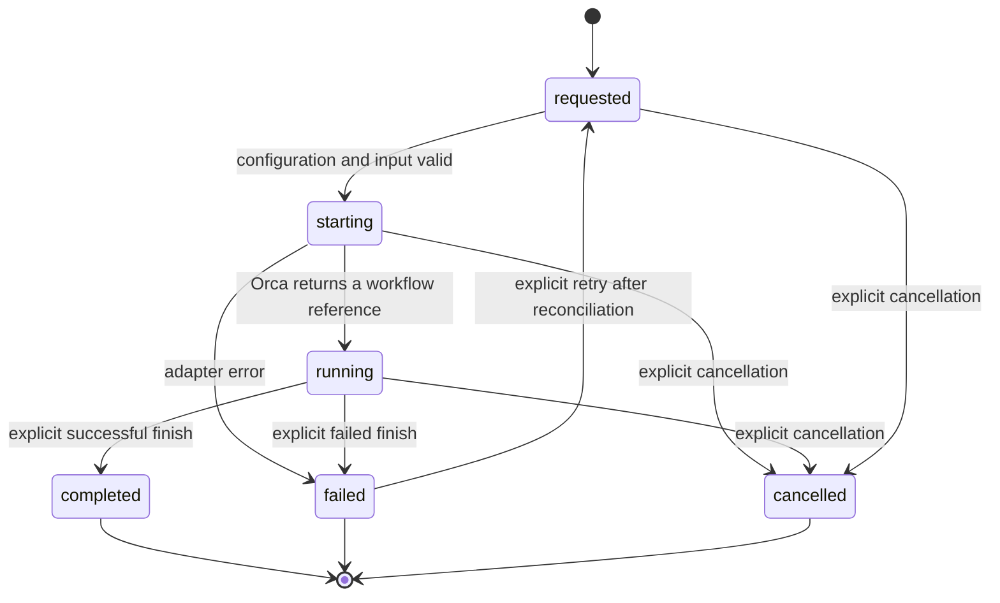
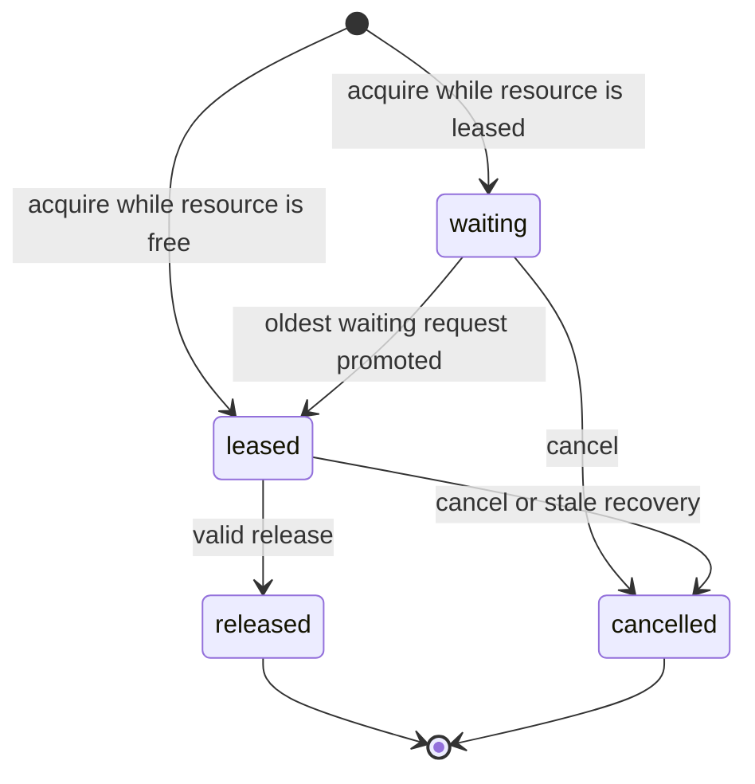

# Flybridge v1 specification

## Purpose and scope

Flybridge starts and observes Orca-native software-development workflows. It
supports a single-agent mode and a role-separated mode, optional manual
selection from a GitHub Project, external skill indexes, and deterministic
exclusive-resource coordination.

Version 1 does not support another IDE, board-driven operation as a requirement,
automatic prioritization, autonomous issue selection, configuration from the
environment, or copying private skill content into a repository.

## Configuration contract

- The effective user configuration is one JSONC file passed with `--config`,
  defaulting to `config/flybridge.jsonc`.
- Only `start --mode` and `doctor --mode` override `default_mode`, and only
  `start --queue-observer` / `start --no-queue-observer` override
  `queue.observer`. Other command-line arguments are operation inputs rather
  than overrides for JSONC fields. Environment variables and XDG configuration
  locations are not configuration inputs.
- English and Japanese example configurations are committed. A user's
  configuration and its absolute skill paths are ignored by Git.
- Runtime state may use the configured state directory. Its default is an XDG
  state location, but that location never supplies user configuration.
- A skill path may be a document, a catalog directory, or a glob pattern.
  `~` is expanded and directory symbolic links are resolved. Catalog
  directories expand recursively to sorted `SKILL.md` documents. Glob matches
  and resolved documents must exist before an Orca workflow is started. A
  catalog entry that resolves outside its configured root is rejected.
- `skills.sources`, role-specific paths, and `skills.language_specific` are
  combined in that order with duplicate paths removed. An empty
  `language_specific` list means no language overlay is injected.

## Workflow contract

- A start request has a repository, a mode, a name, and an English objective.
- `single` starts one agent role. `orchestrated` creates the fixed durable plan
  `manager`, then `worker`, then `reviewer`; Flybridge rather than an LLM decides
  this order.
- The manager prompt permits planning and a concise handoff only. It explicitly
  forbids implementation, agent creation, delegation, and nested orchestration;
  only Flybridge launches the planned worker and reviewer records.
- An orchestrated start launches the manager and persists requested child records.
  `workflow advance <manager-id>` launches exactly the next eligible child after
  its predecessor reaches `completed`. Each child is an Orca child worktree based
  on its completed parent's checked-out branch.
- Because a child worktree is created from that branch, only committed work
  reaches the next role. Every orchestrated role prompt states this, and a child
  launch fails when the source role's worktree still has uncommitted changes,
  so an implementation is never silently dropped before review.
- Before a child is launched, its required single-line handoff summary is
  included in the English prompt. A missing or mismatched handoff prevents the
  Orca create operation.
- The command returns structured output containing the workflow reference and
  fails non-zero without a partial local workflow record if preflight fails.
- An Orca reference is the complete worktree ID returned by Orca, not merely a
  local path. It is used for every terminal and lifecycle operation.
- Flybridge persistently records the complete Orca worktree ID, path, and startup
  terminal handle before it updates Orca lifecycle metadata. If that update fails,
  it closes the exact owned worktree terminals and retains the failed record.
- `workflow resume <workflow-id>` accepts only a persisted `running` record. It
  verifies the complete recorded worktree ID with an exact ID selector and never
  creates a worktree. A valid recorded agent terminal is reused; a stale or
  missing handle is replaced once in that existing worktree after bounded
  TUI-idle confirmation. The replacement atomically supersedes stale agent
  ownership without affecting separately owned observer terminals.
- A root start is rejected when the same resolved repository and objective
  already has a `requested`, `starting`, or `running` root, unless `--allow-duplicate` is
  explicit. Different objectives in one repository remain independent.
- Default workflow names combine sub-second time and a random suffix so
  concurrent generated names do not depend on second-level clock precision.
- Workflow records are retained in SQLite after terminal states for audit and
  retry history. Cleanup closes or removes recorded external ownership and
  atomically marks it reconciled with any required cancellation; it does not
  delete workflow history. A lifecycle claim older than the operator-supplied
  cleanup age can be taken over after a crashed process, while a newer claim is
  never disturbed.
- Completing, failing, or cancelling a running workflow updates Orca metadata
  before the corresponding local terminal state is committed, then closes every
  terminal owned by that exact worktree.
- Orca's default board statuses distinguish active from inactive workspaces:
  `running` maps to `in-progress`, and every terminal Flybridge state maps to
  `completed`. The Flybridge record and the Orca worktree comment retain the
  distinct `completed`, `failed`, or `cancelled` outcome.
- Cancelling a requested or starting role also cancels requested successor roles.
  A failed role can return to requested only through explicit retry after its
  external ownership has been reconciled. Retry cancels queue requests left by
  the failed execution before making the workflow requested again. `workflow
  launch` starts a requested single or manager root. Requested child roles start
  through `workflow advance`.
- `start`, `workflow launch`, `workflow advance`, and `workflow resume` fail closed
  when the live Orca runtime is not reachable.
- If Orca allocates a worktree but returns an incomplete start response, Flybridge
  preserves the exact returned identity and performs bounded compensating cleanup;
  a cleanup failure remains explicitly recoverable.
- Before a workflow record or worktree is created, Flybridge detects `.gitmodules`
  and runs `git submodule update --init --recursive --checkout` with repository
  hooks disabled. The explicit checkout mode overrides a custom local submodule
  update strategy. This defensive operation is skipped only for repositories
  that do not declare submodules.
- Before a workflow record or worktree is created, Flybridge idempotently registers
  the target repository with Orca. Registration failure leaves no local workflow record.
- Prompts are English. A configured response-language string is interpolated
  only as data, for example `Japanese`; it does not change the prompt template's
  language.
- Resume prompts concisely restore the original objective and role plus the
  currently configured response language, applicable skill paths, and resource
  coordination context.
- A prompt receives a local document index, never the contents of private skill
  documents. The agent is instructed to read applicable documents at those
  paths and not copy their contents into a repository without user direction.
- Every role required by the selected mode has an explicitly configured Orca
  agent. Flybridge does not silently choose an agent.

## Resource queue contract

For each resource name, Flybridge maintains a durable first-in, first-out
queue. A request is identified by a generated request identifier and its workflow owner ID.

- Acquisition, release, cancellation, promotion, and event recording occur in
  one SQLite transaction.
- A release or cancellation promotes exactly the oldest waiting request for the
  same resource.
- A lease identifier is required to release a lease. An invalid or mismatched
  identifier is an error and cannot affect another request. CLI acquire accepts
  only a running workflow owner. CLI release and inspect require that owner.
- Every acquire result includes a request identifier so an unleased waiting
  request can be cancelled. A lease identifier is present only after a grant.
- Repeating acquire for the same resource and active owner returns the existing
  request instead of adding a duplicate waiter.
- Stale recovery is explicit: an operator supplies the minimum age and the
  queue transaction cancels only older leased requests, then promotes FIFO
  waiters. There is no automatic expiry.
- The observer prints queue events and current counts in a visible Orca
  terminal. It is observational and cannot change queue ordering.
- A root workflow opens the observer when enabled in JSONC or by CLI override.
  Observer startup failure marks that workflow failed and closes its recorded
  owned terminals.
- Callers name a resource for any mutually interfering process; the queue does
  not encode a special category such as verification.
- Configured resource names are included in role prompts with CLI acquire,
  inspect, and release commands, including `--config` and `--owner`. A waiting
  caller can inspect its own request and receives its lease identifier after
  FIFO promotion. CLI inspect and release require the durable request owner.
- `queue.resources` is the prompt-injection list of names agents should
  coordinate. The queue itself accepts any resource name.
- Queue connections use a bounded SQLite lock wait so short CLI contention
  does not silently violate FIFO ordering.

## GitHub and queue contracts

- GitHub support is disabled unless the JSONC configuration enables it. It may
  page through and list eligible Project items by configured status and priority but never
  selects one, mutates Project data, or starts work. When enabled,
  `priority_values` must be a non-empty allowlist.
- Resource acquire, inspect, release, and status are CLI operations. Agents and
  operators use the same commands against one durable queue.
- Cancellation and explicit stale recovery are operator-only CLI operations.
  Workflow termination cancels active requests whose owner is that workflow ID
  or is no longer a known workflow.
- GitHub integration may not mutate configuration or create a persistent
  Flybridge service.
- `cleanup` reports active Flybridge records and unreconciled failed or cancelled
  worktree records by default. Its dry-run
  includes each candidate's recorded status, last update, and Orca reference.
  Applying age-based cleanup requires both an explicit age threshold and
  `--force-age`, because age alone is not a liveness signal; it closes recorded owned terminals,
  removes only the exact persisted Orca worktree reference, then atomically marks that external
  ownership reconciled and records cancellation when applicable. Failed-start records remain failed for
  diagnosis after their owned worktree is reconciled. It never
  scans for or kills unrelated system processes.

## Failure, observability, and privacy

- CLI commands emit JSON for successful machine-readable results and a concise
  error to standard error on failure. Adapter failures include the invoked
  operation without leaking configured private paths beyond the local caller.
- State directories and SQLite files use private permissions where the platform
  supports them. Skill paths reject unsafe control characters. Catalog
  expansion refuses documents that resolve outside the configured root.
- Every queue state transition produces a sequence-numbered event.
- Event readers page through bounded batches, and state retains the latest
  10,000 events so long-lived observers and databases remain bounded.
- Public CI audits tracked UTF-8 source for legacy organisation/person names,
  identifier and separator variants, Unicode-normalized forms, and known local
  workspace paths. Undecodable or NUL-containing tracked files fail closed. The
  audit and its regression tests remain in the history-free public tree.
- Prompts, documentation, examples, and committed source contain no private
  skill content or private repository paths.

## Acceptance criteria for v1

1. A fresh clone can use an example configuration as a template and run
   `doctor`, single mode, and orchestrated mode with Orca available.
2. Single and orchestrated starts both create a durable workflow record and
   return its reference.
3. Queue ordering, cancellation, stale-record recovery, and observer output are
   covered by automated tests.
4. GitHub screening is optional and cannot dispatch work automatically.
5. Independent CLI queue callers share one durable FIFO; inspect reports
   promotion after another owner releases.
6. Closing a client leaves no Flybridge-owned background process; cleanup can
   report and reconcile stale Flybridge records.
7. Formatting, linting, tests, and the public-release audit pass before the
   repository is made public.
